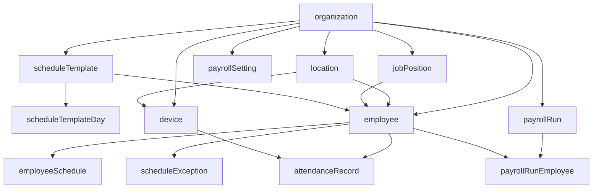

# Database Seeding Setup (Actualizado) — drizzle-seed + schema actual

## Qué cambió en la DB (audit)

- **Nuevas tablas de scheduling**: `schedule_template`, `schedule_template_day`, `schedule_exception`.
- **Scheduling ahora es “template + manual + excepciones”**: el endpoint `GET /scheduling/calendar` combina `schedule_template_day` (si `employee.scheduleTemplateId` existe), `employee_schedule` (manual) y `schedule_exception`.
- **Payroll depende de `employee_schedule`**: el cálculo en `routes/payroll.ts` carga `employee_schedule` por empleado para horas esperadas.
- **Columnas nuevas/relevantes**:
    - `location.time_zone` (default `America/Mexico_City`) — usado para cortar días en nómina.
    - `payroll_setting.time_zone` (default `America/Mexico_City`) — usado para interpretar límites de periodos de pago (inicio/fin del periodo).
    - `payroll_setting.additional_mandatory_rest_days` (jsonb) — se combina con días obligatorios MX.
    - `payroll_run_employee.mandatory_rest_day_premium_amount`.
    - `job_position.hourly_pay` fue removido (migración `0016`): el salario por hora se deriva desde `daily_pay` + divisor del turno (y se persiste en `payroll_run_employee.hourly_pay`).
    - `employee.location_id` y `device.location_id` ahora pueden ser **NULL** (migraciones `0014`/`0015`).
- **Tablas BetterAuth existen en el schema** (`user/session/account/verification/device_code/apikey/member/invitation`) y deben **conservarse** en reset según tu elección.

Archivos clave (actual):

- Esquema: [`apps/api/src/db/schema.ts`](apps/api/src/db/schema.ts)
- Conexión DB: [`apps/api/src/db/index.ts`](apps/api/src/db/index.ts) (usa `SEN_DB_URL`)
- Migraciones recientes: [`apps/api/drizzle/0014_employee_location_nullable.sql`](apps/api/drizzle/0014_employee_location_nullable.sql), [`apps/api/drizzle/0015_young_marauders.sql`](apps/api/drizzle/0015_young_marauders.sql), [`apps/api/drizzle/0016_marvelous_blazing_skull.sql`](apps/api/drizzle/0016_marvelous_blazing_skull.sql)

## Objetivo del seed

- **Poblar tablas de dominio** para que funcionen out-of-the-box:
    - Scheduling (templates + calendario)
    - Payroll (cálculo/proceso de corridas)
    - Attendance básico
- **Reset seguro (solo dominio)**: no truncar tablas de BetterAuth.

## Tablas de dominio a seedear (schema actual)

- `organization`
- `location`
- `job_position`
- `schedule_template`
- `schedule_template_day`
- `employee`
- `employee_schedule`
- `schedule_exception`
- `device`
- `attendance_record`
- `payroll_setting`
- `payroll_run`
- `payroll_run_employee`

> Nota: `client` sigue marcado como `@deprecated` en `schema.ts` y se recomienda **no seedearlo**.

## Orden de dependencias (actualizado)



## Perfil de datos (dev) — conteos sugeridos

| Tabla | Conteo | Notas |

|---|---:|---|

| `organization` | 2 | tenant principal + secundario |

| `location` | 4 | 2 por organización (con `timeZone` + `geographicZone`) |

| `job_position` | 6 | 3 por organización (con `dailyPay/paymentFrequency`) |

| `schedule_template` | 6 | 3 por organización (DIURNA/NOCTURNA/MIXTA) |

| `schedule_template_day` | 42 | 7 por template (con `unique(templateId, dayOfWeek)`) |

| `employee` | 50 | distribuidos por `locationId`, `jobPositionId`, `scheduleTemplateId`, `shiftType` |

| `employee_schedule` | ~350 | 7 días por empleado (para soportar payroll) |

| `schedule_exception` | ~20–40 | algunos DAY_OFF/MODIFIED en el rango reciente |

| `device` | 8 | 2 por location (aunque `locationId` sea nullable, seedearlo set) |

| `attendance_record` | ~200 | check-in/out alineado al horario |

| `payroll_setting` | 2 | 1 por org; incluye `additionalMandatoryRestDays` |

| `payroll_run` | 4 | 2 por org |

| `payroll_run_employee` | ~50 | 1 por empleado en corridas |

## Diseño del seed (actualizado)

### 1) Instalar drizzle-seed

- Instalar en `apps/api`.

### 2) Crear “seed schema” SOLO dominio

- Crear un objeto `seedSchema` (por ejemplo en `apps/api/src/db/seed-schema.ts`) exportando **solo** las tablas listadas arriba.
- Razón: `reset(db, schema)` truncaría también BetterAuth si usáramos `import * as schema from './schema'`.

### 3) Script `apps/api/scripts/seed.ts`

- Conectar usando el mismo `SEN_DB_URL` (o reutilizar `apps/api/src/db/index.ts`).
- Implementar 2 modos:
    - **Seed normal**: `seed(db, seedSchema, { seed: <numero> })` + `.refine(...)`.
    - **Reset dominio**: `reset(db, seedSchema)`.
- Parseo de flags:
    - `--reset`: ejecuta `reset` y luego `seed`.
    - (Opcional) `--seed <n>` para cambiar el PRNG.

Recomendaciones de refinements:

- **IDs**: usar `funcs.uuid()` para columnas `id` (aunque sean `text`).
- **Enums**: usar `funcs.valuesFromArray({ values: [...] }) `para `shiftType`, `paymentFrequency`, `status`.
- **Restricciones únicas**:
    - `location.code`, `job_position.name` (si aplica por org), `employee.code`, `device.code`.
    - `schedule_template_day` y `employee_schedule` deben respetar `unique(..., dayOfWeek)`.
    - `schedule_exception` debe evitar duplicar `employeeId + exceptionDate`.
- **Fechas**: usar `date-fns` para generar rangos (últimas 2–4 semanas) y horarios.
- **Payroll columns**: asegurar que se poblen los montos nuevos (incluye `mandatoryRestDayPremiumAmount`).

### 4) Scripts de package.json (corrección Bun args)

Agregar en [`apps/api/package.json`](apps/api/package.json):

- `db:seed`: ejecuta el script.
- `db:reset`: ejecuta el script con `--reset`.

Nota importante: para pasar flags a Bun de forma consistente, usar `--` para forwardear argumentos.

### 5) Validación rápida (manual)

- Ejecutar migraciones y luego seed.
- Verificar que:
    - `GET /scheduling/calendar` devuelve empleados con `days`.
    - `POST /payroll/calculate` y `POST /payroll/process` producen corridas y líneas.

## Uso (actualizado)

```bash
# Seed (después de migrar)
bun run db:seed

# Reset SOLO dominio + seed
bun run db:reset
```

## Notas

- **Reset scope**: Por tu selección, el reset debe ser **solo dominio** (no tocar BetterAuth).
- `employee.locationId` y `device.locationId` son nullable, pero el seed debe setearlos para datos más realistas.
- Mantener el seed determinista fijando `seed: <n>` en `drizzle-seed`.
