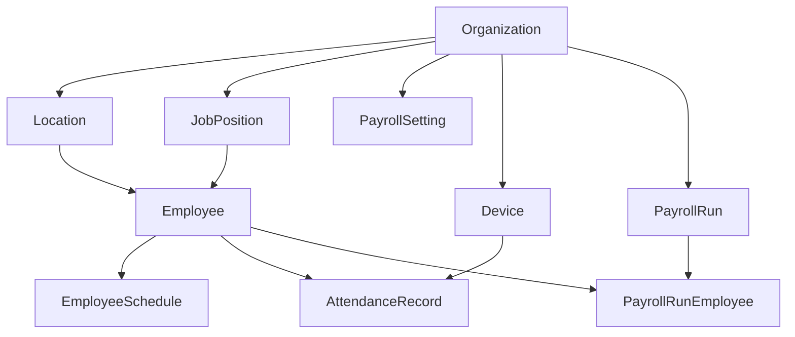

# Database Seeding Plan with drizzle-seed

## Overview

Create a deterministic seed script using `drizzle-seed` to populate the database with realistic development data for testing the check-in/payroll system. The seed will generate data for all domain tables while respecting foreign key relationships.

## Key Files

- **Schema**: [`apps/api/src/db/schema.ts`](apps/api/src/db/schema.ts) - Contains all table definitions
- **DB Connection**: [`apps/api/src/db/index.ts`](apps/api/src/db/index.ts) - Drizzle client setup
- **Package**: [`apps/api/package.json`](apps/api/package.json) - Dependencies and scripts

## Data Generation Strategy



### Seed Counts (Development Profile)

| Table | Count | Notes |

|-------|-------|-------|

| Organization | 2 | Primary + secondary tenant |

| Location | 4 | 2 per organization |

| JobPosition | 6 | 3 per organization |

| Employee | 50 | Distributed across locations |

| Device | 8 | 2 per location |

| EmployeeSchedule | ~350 | 7 days per employee |

| AttendanceRecord | ~200 | Sample check-ins/outs |

| PayrollSetting | 2 | 1 per organization |

| PayrollRun | 4 | 2 per organization |

| PayrollRunEmployee | ~50 | 1 per employee in runs |

## Implementation Steps

### 1. Install drizzle-seed

Add the `drizzle-seed` package to the API workspace:

```bash
bun run add:api -- drizzle-seed
```

### 2. Create Seed Script

Create [`apps/api/scripts/seed.ts`](apps/api/scripts/seed.ts) with:

- Import schema and drizzle-seed
- Use `seed()` function with refinements for realistic data
- Generate Mexican-style names and company data (aligned with LFT payroll)
- Use `valuesFromArray` for enums like `shiftType`, `employeeStatus`
- Seed tables in dependency order (organizations first, then locations, then employees, etc.)

### 3. Add Reset Capability

Include `reset()` function option to clear existing data before seeding using drizzle-seed's built-in TRUNCATE with CASCADE.

### 4. Add NPM Scripts

Add to [`apps/api/package.json`](apps/api/package.json):

```json
{
  "scripts": {
    "db:seed": "bun run scripts/seed.ts",
    "db:reset": "bun run scripts/seed.ts --reset"
  }
}
```

## Refinements for Realistic Data

The seed script will use custom refinements for:

- **Organizations**: Mexican company names with realistic slugs
- **Employees**: Mexican first/last names, unique employee codes (EMP-XXXX)
- **Job Positions**: Spanish titles (Gerente, Analista, Operador, etc.)
- **Locations**: Mexican city names and addresses
- **Attendance**: Time-bounded check-ins/outs within work hours
- **Payroll**: Calculated values based on hourly rates and hours worked

## Usage

```bash
# Seed the database (after running migrations)
bun run db:seed

# Reset and re-seed (clears existing data)
bun run db:seed --reset
```

## Notes

- The seed is deterministic (same seed number = same data)
- Auth tables (`user`, `session`, `account`) are excluded as they're managed by BetterAuth
- The deprecated `client` table is skipped
- Foreign keys are respected through ordered seeding