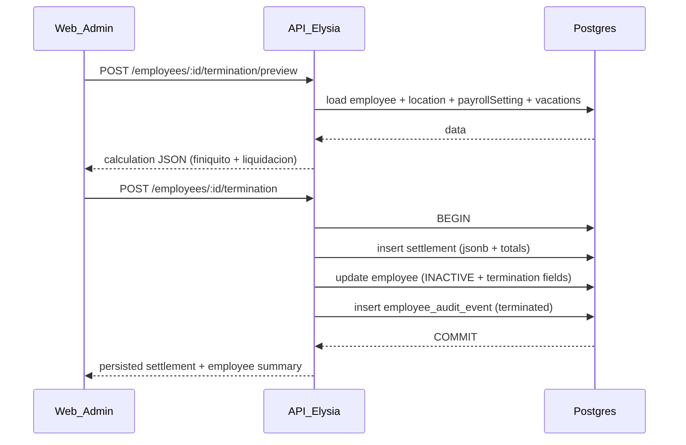

# Feature: cálculo y registro de finiquito por baja (COMPLETADO)

Este plan se considera **completado** (feature ya implementada). El trabajo restante/activo para **recibos PDF** se consolidó en:

- `.cursor/plans/payroll-receipts-pdf-zip_5fc47c15.plan.md`

## Documentación (reglas de terminación)

- **Reglas y fórmulas fuente de verdad**: [`documentacion/finiquito-docs.md`](documentacion/finiquito-docs.md) (LFT 2026: finiquito vs liquidación, matriz de decisión, inputs mínimos, fórmulas y salida auditable).

## Decisión de arquitectura (ruta)

- **Dónde vive**: en [`apps/api/src/routes/employees.ts`](apps/api/src/routes/employees.ts) como sub-rutas por empleado, porque el cálculo depende de datos del empleado + settings de nómina + saldo de vacaciones y ya existe el patrón de “cómputos por empleado” con `GET /employees/:id/insights`.
- **Ruta separada (futuro)**: si luego necesitas listados/reportes org-wide de bajas/finiquitos, se puede agregar un `/terminations` o `/settlements`, pero para V1 no es necesario.

## Data model (DB + auditoría)

- **Agregar campos a `employee`** en [`apps/api/src/db/schema.ts`](apps/api/src/db/schema.ts):
  - `terminationDateKey` (text, `YYYY-MM-DD`) 
  - `lastDayWorkedDateKey` (text, `YYYY-MM-DD`, default = terminationDateKey)
  - `terminationReason` (pgEnum con valores del doc)
  - `contractType` (pgEnum: `indefinite | fixed_term | specific_work`)
  - (opcional) `terminationNotes` (text nullable)
  - (opcional) `nss` y `rfc` (text nullable) para mostrar en recibos cuando existan
- **Nueva tabla** `employee_termination_settlement` (o nombre similar) para snapshot auditable:
  - `id`, `employeeId`, `organizationId`, `createdAt`
  - `calculation` (jsonb) con el output del doc (incluye `inputs_used` + `breakdown` + `totals`)
  - `totalsGross` (numeric) y opcionalmente `finiquitoTotalGross` / `liquidacionTotalGross` para consultas rápidas
- **Auditoría**: extender [`apps/api/src/services/employee-audit.ts`](apps/api/src/services/employee-audit.ts) para que `buildEmployeeAuditSnapshot` incluya los nuevos campos de terminación, y registrar un evento `action: 'terminated'` al ejecutar la baja.

## Motor de cálculo (API service)

- Crear un servicio dedicado, p.ej. [`apps/api/src/services/finiquito-calculation.ts`](apps/api/src/services/finiquito-calculation.ts), que:
  - Use **date keys** (`YYYY-MM-DD`) como entrada principal (evita bugs por zona horaria).
  - Reuse utilidades existentes:
    - Redondeo monetario: `roundCurrency` de [`apps/api/src/utils/money.ts`](apps/api/src/utils/money.ts)
    - Mínimo salarial por zona: `resolveMinimumWageDaily` de [`apps/api/src/utils/minimum-wage.ts`](apps/api/src/utils/minimum-wage.ts)
    - Salario integrado/SBC diario: `getSbcDaily` de [`apps/api/src/services/mexico-payroll-taxes.ts`](apps/api/src/services/mexico-payroll-taxes.ts)
    - Devengo de vacaciones: `calculateVacationAccrual` / `buildEmployeeVacationBalance` de [`apps/api/src/services/vacations.ts`](apps/api/src/services/vacations.ts) y [`apps/api/src/services/vacation-balance.ts`](apps/api/src/services/vacation-balance.ts)
  - Calcule **finiquito (siempre)**:
    - `salary_due` (salarios pendientes) a partir de `unpaid_days` (input)
    - `aguinaldo_prop` prorrateado por año calendario (365/366)
    - `vacation_pay` con **saldo en días que soporte decimales** (default: `(accruedDays - usedDays)` al corte de terminación; permitir override)
    - `vacation_premium` con `vacationPremiumRate` (settings)
    - `other_due` (input)
  - Calcule **conceptos de liquidación/indemnización** cuando correspondan, pero el UI decide si los muestra/colapsa:
    - `prima_antiguedad` (Art. 162 + tope 2× mínimo) según matriz
    - `indemnizacion_3_meses` (90 días LFT)
    - `indemnizacion_20_dias` (según `contractType`, usando el criterio del doc)
  - Devuelva siempre un JSON “auditable” tipo el de tu doc (incluyendo `inputs_used`).

## API: endpoints

En [`apps/api/src/routes/employees.ts`](apps/api/src/routes/employees.ts):

- **Preview (no persiste)**: `POST /employees/:id/termination/preview`
  - Resuelve employee + location(zone) + payrollSetting(aguinaldoDays, vacationPremiumRate) y devuelve el cálculo.
- **Confirmar baja (persiste)**: `POST /employees/:id/termination`
  - Transacción:
    - recalcular en servidor (no confiar en totales del cliente)
    - insertar `employee_termination_settlement`
    - actualizar `employee.status = INACTIVE` + campos de terminación
    - insertar `employee_audit_event` (`terminated`)
  - Responder con el settlement guardado + campos clave del empleado.
- **(Opcional V1)**: `GET /employees/:id/termination` para recuperar la baja y el último settlement (útil para re-abrir el detalle).

Validación:

- Crear schemas zod en [`apps/api/src/schemas/termination.ts`](apps/api/src/schemas/termination.ts) (dateKey, enums, números >= 0, overrides opcionales).

## Web UI (Admin)

En `[apps/web/app/(dashboard)/employees/employees-client.tsx](apps/web/app/\\(dashboard)/employees/employees-client.tsx)`:

- Agregar una pestaña nueva **“Finiquito”** dentro del dialog de detalle del empleado.
- Formulario (inputs mínimos):
  - fecha de terminación (date key)
  - motivo (`terminationReason`)
  - tipo de contrato (`contractType`)
  - días no pagados (`unpaidDays`)
  - otros adeudos (`otherDue`)
  - overrides opcionales: `vacationBalanceDays`, `dailySalaryIndemnizacion`
- Botón **“Calcular”** (preview) y render de:
  - Cards con breakdown de **Finiquito**
  - `Accordion` para sección **“Liquidación / indemnización”** (colapsable) usando [`apps/web/components/ui/accordion.tsx`](apps/web/components/ui/accordion.tsx)
- Botón **“Confirmar baja”** con confirm dialog (`Dialog`) que llama al endpoint de persistencia.
- Actualizar `auditFieldLabels` para mostrar etiquetas en auditoría de los nuevos campos.

Acciones:

- Añadir server actions en [`apps/web/actions/employees.ts`](apps/web/actions/employees.ts):
  - `previewEmployeeTermination(...)`
  - `terminateEmployee(...)`

usando `createServerApiClient` de [`apps/web/lib/server-api.ts`](apps/web/lib/server-api.ts).

i18n:

- Agregar keys en [`apps/web/messages/es.json`](apps/web/messages/es.json) bajo `Employees.*` para labels, placeholders, mensajes de validación y el enum de motivos/tipo contrato.

## Recibo imprimible (PDF) de baja (firma)

Objetivo: al **confirmar la baja** (`POST /employees/:id/termination`), el admin debe poder **descargar/impimir un recibo** para que el empleado **firme** y reconozca el monto recibido.

Diseño (comparación de imágenes):

- **Mínimo obligatorio (2ª imagen)**:
  - Encabezado con título (p.ej. “RECIBO DE FINIQUITO / BAJA”) y fecha de pago.
  - Datos del empleado: nombre, clave/ID interno y NSS/RFC (opcionales; mostrar `—` si faltan).
  - Tabla tipo recibo con secciones:
    - **Ingresos**: conceptos del finiquito (y, si aplica, sección liquidación/indemnización).
    - **Deducciones**: por ahora 0 / o futuras deducciones configurables.
    - Totales (mínimo: total y “neto recibido”).
  - Leyenda “Recibí de la empresa … la cantidad anotada … y declaro que …”.
  - Campo “Firma del empleado” (línea) y folio/identificador del documento.
- **Agregar resumen fiscal (1ª imagen, sin emojis) — recomendado**:
  - Mostrar arriba un bloque “Resumen fiscal” para contextualizar (p.ej. percepciones, retenciones del trabajador y aportaciones del patrón) **cuando exista una última nómina PROCESADA** del empleado.
  - Nota: el cálculo de finiquito/liquidación en V1 es *bruto*; no modela impuestos del finiquito. Por eso, el resumen fiscal se toma de la última nómina (si existe) y no del finiquito.

Implementación propuesta:

- **API (leer settlement persistido)**:
  - Agregar `GET /employees/:id/termination/settlement` (o `/settlements/latest`) en [`apps/api/src/routes/employees.ts`](apps/api/src/routes/employees.ts) para devolver el último `employee_termination_settlement` (incluye `calculation`, `createdAt`, `totals*`).
  - Validar acceso con `hasOrganizationAccess`/org del empleado.
- **Web (descarga PDF)**:
  - Agregar endpoint Next.js que genere PDF con `pdf-lib`:
    - Sugerido: [`apps/web/app/api/employees/[employeeId]/termination/receipt/route.ts`](apps/web/app/api/employees/[employeeId]/termination/receipt/route.ts)
    - Flujo: `getAdminAccessContext()` → `createServerApiClient(cookieHeader)` → `GET /employees/:id/termination/settlement` → construir PDF → responder `Content-Type: application/pdf` + `Content-Disposition: attachment`.
  - UI: después de terminar con éxito, mostrar botón “Descargar recibo” en la pestaña **Finiquito** (y también permitir re-descarga si el empleado ya está INACTIVE y hay settlement).

Tests (mínimo):

- Contract test: extender [`apps/api/src/routes/employees.contract.test.ts`](apps/api/src/routes/employees.contract.test.ts) para validar el nuevo `GET /employees/:id/termination/settlement`.
- E2E (Playwright): terminar un empleado y verificar que el botón descargue un PDF cuyo contenido inicia con `%PDF-` y filename esperado.

## Shared types

En [`packages/types/src/index.ts`](packages/types/src/index.ts):

- Añadir tipos compartidos:
  - `TerminationReason`, `EmploymentContractType`
  - `EmployeeTerminationPreviewInput`
  - `EmployeeTerminationSettlement` (shape del JSON auditable)

## Tests

- Contract tests: extender [`apps/api/src/routes/employees.contract.test.ts`](apps/api/src/routes/employees.contract.test.ts):
  - preview devuelve estructura esperada
  - terminate marca INACTIVE + guarda campos + retorna settlement
  - segunda terminación para el mismo empleado → `409` (o `400`) para evitar doble-baja
- Unit tests del motor: nuevo [`apps/api/src/services/finiquito-calculation.test.ts`](apps/api/src/services/finiquito-calculation.test.ts) con escenarios base (renuncia, despido injustificado, antigüedad >=15).

## Diagrama (flujo)

