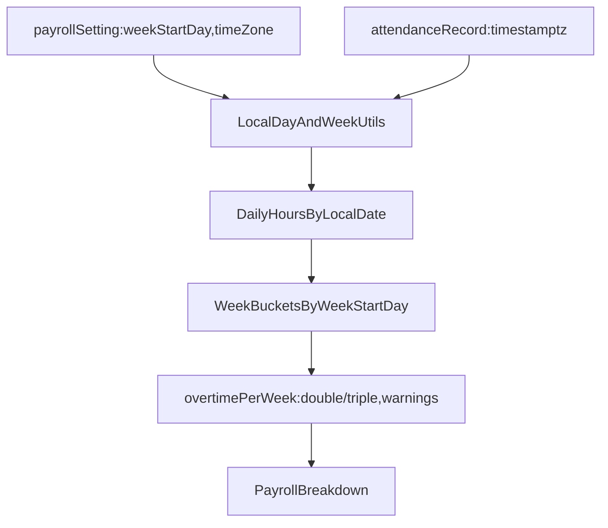

# Mexico payroll/LFT corrections plan (advisory-only)

## Scope & success criteria

- **Fix correctness bugs** in Mexico payroll calculation and schedule warnings described in `.cursor/todos/audit-payroll-mx-2025-121225.md`.
- **Advisory-only**: never block schedule creation or payroll processing; we only emit warnings and show them in the web UI.
- **Org settings define calendar semantics**: add **`timeZone`** (IANA) + use existing **`weekStartDay`**.

## Key discoveries (current code)

- **UTC day grouping is hardcoded** in payroll via `toISOString().slice(0, 10)` and `getUTCDay()` in [`apps/api/src/routes/payroll.ts`](apps/api/src/routes/payroll.ts).
- **Weekly limits are applied across the entire pay period** (e.g. BIWEEKLY/MONTHLY) by using a single weekly threshold after summing all days in [`apps/api/src/routes/payroll.ts`](apps/api/src/routes/payroll.ts).
- **API schedule validator weekly overtime is mis-modeled** as `weeklyHours - weeklyLimit` in [`apps/api/src/utils/schedule-validator.ts`](apps/api/src/utils/schedule-validator.ts).
- **Job positions normalize pay with `/8` and `*8`**, which makes the “source-of-truth” ambiguous and can distort NOCTURNA/MIXTA payroll if we pick the wrong field.

## Proposed architecture

## Implementation plan

### 1) Add `timeZone` to payroll settings (org-level)

- **DB**: extend `payroll_setting` with a `time_zone` column.
    - Files:
        - [`apps/api/src/db/schema.ts`](apps/api/src/db/schema.ts)
        - new Drizzle migration in `apps/api/drizzle/` (SQL)
- **API validation**: extend Zod schema and route payloads.
    - Files:
        - [`apps/api/src/schemas/payroll.ts`](apps/api/src/schemas/payroll.ts)
        - [`apps/api/src/routes/payroll-settings.ts`](apps/api/src/routes/payroll-settings.ts)
- **Web UI**: add a “Time zone” setting (IANA string) and explain why it matters (Sunday/day boundaries).
    - Files:
        - `[apps/web/app/(dashboard)/payroll-settings/payroll-settings-client.tsx](apps/web/app/\\\(dashboard)/payroll-settings/payroll-settings-client.tsx)`
- **Default/rollout**:
    - Store `timeZone` as **required in UI** but **non-breaking in backend**.
    - If `timeZone` is missing/empty, backend falls back to `'UTC'` and emits a warning like `PAYROLL_TIMEZONE_NOT_CONFIGURED` so customers must set it.

### 2) Create timezone-aware “local day” utilities (API)

- Add a small utility module that:
    - Produces a **local date key** `yyyy-MM-dd` in an org timezone.
    - Splits a check-in/out interval into **per-local-day** segments (next local midnight boundary).
    - Computes **local day-of-week** from the local date.
    - Computes a **week bucket key** based on `weekStartDay` (0–6) in org timezone.
- Files:
    - new [`apps/api/src/utils/payroll-time.ts`](apps/api/src/utils/payroll-time.ts) (or similar)
- Dependency:
    - Prefer `date-fns` + `date-fns-tz` (timezone-safe) in `apps/api`.

### 3) Fix payroll calculation to segment by week within the period

- Refactor [`apps/api/src/routes/payroll.ts`](apps/api/src/routes/payroll.ts):
    1. Load org `timeZone` + `weekStartDay` alongside `overtimeEnforcement` (we will treat everything as WARN in behavior).
    2. Replace `calculateDailyWorkedHours()` to bucket by **local day** rather than UTC day.
    3. Build **week buckets** from local-day buckets using `weekStartDay`.
    4. For **each week bucket**, compute overtime legally:
        - `dayNormal = min(dayHours, shiftLimits.dailyHours)`
        - `dayOver = max(0, dayHours - shiftLimits.dailyHours)`
        - `weeklyNormalExcess = max(0, sum(dayNormal) - shiftLimits.weeklyHours)`
        - `weeklyOvertimeTotal = sum(dayOver) + weeklyNormalExcess`
        - `overtimeDouble = min(weeklyOvertimeTotal, 9)`
        - `overtimeTriple = max(0, weeklyOvertimeTotal - 9)`

    5. Add warnings per-week:
        - **Daily**: `dayOver > 3`
        - **Weekly overtime**: `weeklyOvertimeTotal > 9`
        - **Frequency**: `countDaysWhere(dayOver > 0) > 3`

    6. Aggregate period totals as the sum across week buckets.

This directly fixes audit items:

- **#1** weekly rules applied to full period
- **#2** `weekStartDay` not used in legal segmentation
- **#5** “max 3 times/week” missing
- **#9** UTC-based day/Sunday boundaries

### 4) Sunday premium correctness (conditioned on rest day)

- Update Sunday premium logic in [`apps/api/src/routes/payroll.ts`](apps/api/src/routes/payroll.ts):
    - Determine Sundays using **local day-of-week**.
    - Pay Sunday premium only when:
        - employee worked on Sunday **and**
        - schedule indicates **Sunday is a working day** and there is **at least one rest day** elsewhere in the week pattern.
    - If schedule is missing/ambiguous, keep current calculation but emit a warning like `SUNDAY_PREMIUM_ASSUMED`.

This addresses audit item:

- **#6** Sunday premium applied without rest-day condition

### 5) Align schedule validation (API) with payroll rules

- Update [`apps/api/src/utils/schedule-validator.ts`](apps/api/src/utils/schedule-validator.ts):
    - Replace `weeklyOvertime = weeklyHours - weeklyLimit` with:
        - `weeklyOvertimeTotal = sum(max(0, dayHours - dailyLimit)) + max(0, sum(min(dayHours, dailyLimit)) - weeklyLimit)`
    - Add a check for `weeklyOvertimeTotal > 9`.
    - Add **overtime days/week** count (`dayHours > dailyLimit`) and warn if >3.

This addresses audit item:

- **#3** weekly overtime validator mismatch (missing the 9h weekly overtime cap)
- **#5** missing “3 times/week”

### 6) Align schedule warnings (Web) with API validator

- Update `[apps/web/app/(dashboard)/schedules/components/labor-law-warnings.tsx](apps/web/app/\\\(dashboard)/schedules/components/labor-law-warnings.tsx)`:
    - Add weekly overtime total computation and warnings (>9).
    - Add overtime-days-per-week warning (>3).
    - Keep severity styling, but ensure it never blocks user actions.
- Update blocking behavior in schedule UI (where it currently checks `overtimeEnforcement === 'BLOCK'`) so it never blocks.
    - Files to touch:
        - `[apps/web/app/(dashboard)/schedules/components/template-form-dialog.tsx](apps/web/app/\\\(dashboard)/schedules/components/template-form-dialog.tsx)`
        - `[apps/web/app/(dashboard)/schedules/components/schedule-templates-tab.tsx](apps/web/app/\\\(dashboard)/schedules/components/schedule-templates-tab.tsx)`
- Update payroll settings UI copy to reflect advisory-only (and optionally remove the BLOCK option).
    - `[apps/web/app/(dashboard)/payroll-settings/payroll-settings-client.tsx](apps/web/app/\\\(dashboard)/payroll-settings/payroll-settings-client.tsx)`

### 7) Remove pay-basis ambiguity for Job Positions (fix under/over-pay risk)

You selected: **add `jobPosition.payBasis = DAILY|HOURLY`**.

- **DB**: add `pay_basis` to `job_position`.
    - Files:
        - [`apps/api/src/db/schema.ts`](apps/api/src/db/schema.ts)
        - new migration in `apps/api/drizzle/`
- **API**:
    - Extend job position create/update schemas and routes to accept `payBasis`.
    - Enforce:
        - if `payBasis=DAILY` then require `dailyPay>0`
        - if `payBasis=HOURLY` then require `hourlyPay>0`
    - Derive the non-canonical field for storage/display, but payroll will always compute from the canonical basis.
    - Files:
        - [`apps/api/src/routes/job-positions.ts`](apps/api/src/routes/job-positions.ts)
        - shared schemas/types (see next bullet)
- **Shared types/contracts**:
    - Add `PayBasis` enum + field to shared types so API/web/mobile stay aligned.
    - Files:
        - [`packages/types/src/index.ts`](packages/types/src/index.ts)
        - [`packages/api-contract/src/index.ts`](packages/api-contract/src/index.ts)
- **Payroll**: compute rate by basis:
    - If `DAILY`: `hourlyRate = dailyPay / divisor`, `effectiveDailyPay = dailyPay`
    - If `HOURLY`: `hourlyRate = hourlyPay`, `effectiveDailyPay = hourlyPay * divisor`
    - File:
        - [`apps/api/src/routes/payroll.ts`](apps/api/src/routes/payroll.ts)
- **Web UI**:
    - Add a Pay Basis selector; show/require only the relevant input; show a computed preview of the other value.
    - Files:
        - `[apps/web/app/(dashboard)/job-positions/job-positions-client.tsx](apps/web/app/\\\(dashboard)/job-positions/job-positions-client.tsx)`
        - [`apps/web/actions/job-positions.ts`](apps/web/actions/job-positions.ts)

This addresses audit item:

- **#4** hourly divisor mismatch and “hourlyPay preferred” risk

### 8) Deferred (phase 2) items: holidays + shift-type validation

These are real gaps, but they expand scope into new data models and UI.

- **Holidays / mandatory rest days triple pay** (audit #7)
    - Add `organization_holiday` table (date, name, country, isMandatoryRestDay).
    - Payroll: if hours worked on such day, apply triple pay adjustment (and show breakdown line).
- **Shift type validation against actual hours** (audit #8)
    - For schedule templates: compute overlap with night window (20:00–06:00) and warn if MIXTA has ≥3.5h nocturnal.
    - For payroll: optionally compute nocturnal overlap from attendance intervals and warn if employee shiftType likely misclassified.

## Testing & verification

- Add focused unit tests (Bun test or Vitest) for:
    - timezone local-day splitting (midnight boundaries)
    - week bucketing with `weekStartDay`
    - weekly overtime math (double/triple per week)
    - overtime-days-per-week counting
- Add a few “golden” scenarios from the audit doc (e.g., 2-week 8h/day L–S should produce 0 overtime).

## Rollout notes

- Because calculations will change, ship behind a **feature flag** (org setting) or at minimum add a visible “Payroll rules updated” note in release docs.
- Ensure UI communicates that warnings are advisory and that time zone must be configured for Mexico-accurate day/Sunday boundaries.
