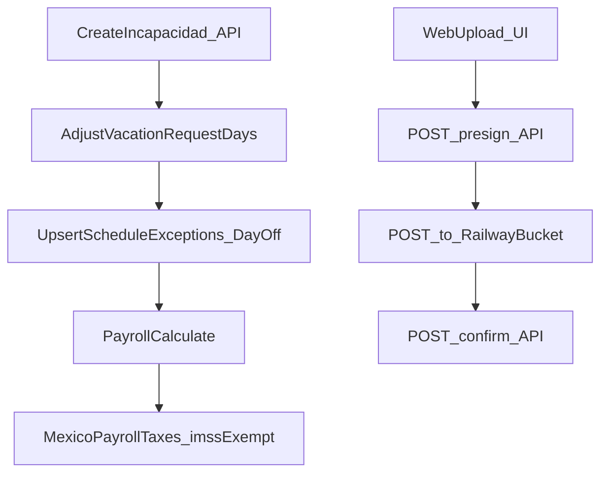

# Feature: Incapacidades (IMSS) end‑to‑end

## Objetivo

- Implementar **captura + cálculo** de incapacidades IMSS basadas en [`documentacion/incapacidades.md`](documentacion/incapacidades.md).
- Que funcione para **cualquier empleado** y afecte:
    - **Nómina**: exención de cuotas IMSS en días de incapacidad (excepto **Retiro**), y cálculo del **subsidio IMSS esperado** (informativo o pagado por el patrón si se habilita a futuro).
    - **Vacaciones**: **incapacidad tiene prioridad** y **ajusta automáticamente** días de vacaciones traslapados para que **no cuenten** como vacaciones.
    - **Calendario / ausencias**: reflejar incapacidades como “días no laborables” para que no aparezcan como faltas.
- **Nice to have (incluido)**: guardar el **documento físico IMSS** (PDF/JPG/PNG) usando **Railway Buckets** con **URLs prefirmadas**.

## Alcance funcional (MVP)

- **Tipos soportados** (según doc): `EG`, `RT`, `MAT`, `LIC140BIS` con mapeo a SAT `01|02|03|04`.
- **Reglas núcleo**:
    - **EG**: subsidio al 60% desde el **día 4** del `caseId`.
    - **RT/MAT**: 100% desde día 1.
    - **LIC140BIS**: 60% desde día 1.
    - **IMSS cuotas**: por días con incapacidad IMSS -> **exentar** IMSS (E&M/IV/GMP/CV/Guarderías/RT), **mantener Retiro (2%)**.
    - **INFONAVIT 5%**: se mantiene (ya lo hace el motor actual); no implementaremos aún amortización de crédito (no existe hoy en el motor).

## Modelo de datos (DB)

- **Nueva tabla** `employee_incapacity` en [`apps/api/src/db/schema.ts`](apps/api/src/db/schema.ts):
    - `id`, `organizationId`, `employeeId`
    - `caseId` (requerido para EG “día 4” cruzando periodos)
    - `type` (`EG|RT|MAT|LIC140BIS`), `satTipoIncapacidad` (`01|02|03|04`)
    - `startDateKey`, `endDateKey`, `daysAuthorized`
    - `certificateFolio` (opcional), `issuedBy` (`IMSS|recognized_by_IMSS`)
    - `sequence` (`inicial|subsecuente|recaida`) y `percentOverride` (opcional)
    - `status` (`ACTIVE|CANCELLED`) + `createdAt/updatedAt`
- **Documento**: nueva tabla `employee_incapacity_document` con metadata:
    - `bucket`, `objectKey`, `fileName`, `contentType`, `sizeBytes`, `sha256`, `uploadedAt`
- **Integración con calendario**: agregar `incapacityId` nullable a `schedule_exception` (tabla existente) para poder crear “DAY_OFF” por incapacidad sin perder trazabilidad (similar a `vacationRequestId`).
- **Vacaciones**: extender enum `vacation_day_type` para agregar `INCAPACITY` (se usa al ajustar días traslapados).
- **Migración**: generar y aplicar una nueva migración Drizzle en [`apps/api/drizzle/`](apps/api/drizzle/) (ej. `0024_*.sql`).

## Motor de cálculo (API)

- **Nuevo servicio puro** en [`apps/api/src/services/incapacities.ts`](apps/api/src/services/incapacities.ts):
    - Intersección por periodo (date keys) y dedupe.
    - Cálculo de `case_day_index` para EG (día 4+) incluso cruzando periodos.
    - Cálculo de `expected_imss_subsidy_amount` usando SBC consistente con el motor actual (SBC diario calculado por [`apps/api/src/services/mexico-payroll-taxes.ts`](apps/api/src/services/mexico-payroll-taxes.ts) y topado por UMA\*25 por día).
    - Salida alineada a la sección “Estructura de salida recomendada” del doc.

## Ajustes de nómina (API)

- Extender [`apps/api/src/services/mexico-payroll-taxes.ts`](apps/api/src/services/mexico-payroll-taxes.ts):
    - Aceptar `imssExemptDateKeys?: string[]`.
    - Calcular dos SBC de periodo:
        - `sbcPeriodTotal` (todos los días) -> **Retiro** e **INFONAVIT 5%**.
        - `sbcPeriodImssBase` (excluye `imssExemptDateKeys`) -> IMSS patronal/obrero, guarderías, RT.
- Extender [`apps/api/src/routes/payroll.ts`](apps/api/src/routes/payroll.ts):
    - Cargar incapacidades activas que traslapan el periodo para todos los empleados del cálculo.
    - Pasar `imssExemptDateKeys` al motor de impuestos y agregar a la respuesta un resumen por empleado (días de incapacidad + subsidio IMSS esperado).
- Actualizar schemas de respuesta en [`apps/api/src/schemas/payroll.ts`](apps/api/src/schemas/payroll.ts).

## Vacaciones (API)

- Al crear/actualizar una incapacidad:
    - Encontrar `vacationRequestDay` traslapados (SUBMITTED/APPROVED) y ajustar:
        - `countsAsVacationDay=false`, `dayType='INCAPACITY'`.
    - Si existían `schedule_exception` por vacaciones (`vacationRequestId`) en esas fechas, eliminarlas.
    - Crear `schedule_exception` por incapacidad (`exceptionType='DAY_OFF'`, `incapacityId=<id>`, `reason='Incapacidad IMSS …'`).
- En [`apps/api/src/routes/vacations.ts`](apps/api/src/routes/vacations.ts):
    - Bloquear nuevas solicitudes (create/approve) si el rango traslapa incapacidades activas, devolviendo 409 con un código específico (p.ej. `VACATION_INCAPACITY_OVERLAP`) y fechas en conflicto.

## Rutas de incapacidades (API)

- Nuevo plugin [`apps/api/src/routes/incapacities.ts`](apps/api/src/routes/incapacities.ts) y registro en [`apps/api/src/app.ts`](apps/api/src/app.ts).
- Endpoints sugeridos:
    - `GET /incapacities` (admin) con filtros: `employeeId`, `from`, `to`, `status`, paginación.
    - `POST /incapacities` (admin) crear + auto‑ajuste vacaciones + crear schedule exceptions.
    - `PUT /incapacities/:id` actualizar (re‑conciliar días y schedule exceptions).
    - `POST /incapacities/:id/cancel` (o `DELETE`) para marcar `CANCELLED` y revertir schedule exceptions.
    - Documentos:
        - `POST /incapacities/:id/documents/presign` -> presigned POST (Railway Buckets).
        - `POST /incapacities/:id/documents/confirm` -> persistir metadata/validar `HeadObject`.
        - `GET /incapacities/:id/documents/:docId/url` -> presigned GET.

## Almacenamiento de documentos (Railway Buckets)

- Basado en docs Railway (Context7):
    - Railway Buckets son **S3-compatible** y recomendados para uploads; endpoint base `https://storage.railway.app`.
    - Usar **presigned POST** (AWS SDK v3) para subir desde el navegador.
    - Configurar **CORS** del bucket para permitir `http://localhost:3001` y el dominio productivo.
- Implementación:
    - Agregar deps API: `@aws-sdk/client-s3` y `@aws-sdk/s3-presigned-post`.
    - Variables: usar presets/refs de Railway para poblar `AWS_ACCESS_KEY_ID`, `AWS_SECRET_ACCESS_KEY`, `AWS_REGION` y un `S3_BUCKET`/`BUCKET` + `S3_ENDPOINT=https://storage.railway.app`.
    - Key naming: `org/<orgId>/employees/<employeeId>/incapacities/<incapacityId>/<docId>-<filename>`.

## Web (Next.js)

- Nuevo módulo HR/admin:
    - Página `[apps/web/app/(dashboard)/incapacities/page.tsx](apps/web/app/\\\\\\\\\\\(dashboard)/incapacities/page.tsx) `+ `incapacities-client.tsx` + `loading.tsx`.
    - Server actions [`apps/web/actions/incapacities.ts`](apps/web/actions/incapacities.ts).
    - Client functions [`apps/web/lib/client-functions.ts`](apps/web/lib/client-functions.ts) + query keys.
    - i18n: agregar strings a [`apps/web/messages/es.json`](apps/web/messages/es.json) (no hardcode).
- UX:
    - Tabla con filtros (empleado, rango, tipo, estatus).
    - Modal “Crear incapacidad” (inputs del doc).
    - Sección “Documento IMSS”: subir archivo -> presign -> POST a S3 -> confirm.
- Nómina UI:
    - En `[apps/web/app/(dashboard)/payroll/payroll-client.tsx](apps/web/app/\\\\\\\\\\\(dashboard)/payroll/payroll-client.tsx) `mostrar (opcional) columnas/tooltip con `días de incapacidad` y `subsidio IMSS esperado` para dar trazabilidad.

## Pruebas

- **API unit**:
    - Nuevos tests para motor de incapacidad (casos A–E del doc) en `apps/api/src/services/incapacities.test.ts`.
    - Tests para `mexico-payroll-taxes` con `imssExemptDateKeys` (verificar: IMSS/RT/guarderías bajan, Retiro e INFONAVIT se mantienen).
- **API contract**:
    - `apps/api/src/routes/incapacities.contract.test.ts` cubriendo CRUD + ajuste de vacaciones + presign.
- **Web unit (Vitest)**:
    - Tests para UI/acciones de incapacidades (manejo de errores, render de dayType `INCAPACITY`).
- **Web e2e (Playwright)**:
    - Caso feliz: navegar a Incapacidades, crear incapacidad; (upload puede mockearse si no hay bucket en CI).

## Calidad / comandos

- Formato: `bun run format`
- Lint: `bun run lint`
- Types: `bun run check-types`
- Tests:
    - API: `bun run test:api:unit` y `bun run test:api:contract`
    - Web: `bun run test:web:unit` (y `bun run test:web:e2e` si aplica)

## Diagrama (alto nivel)

