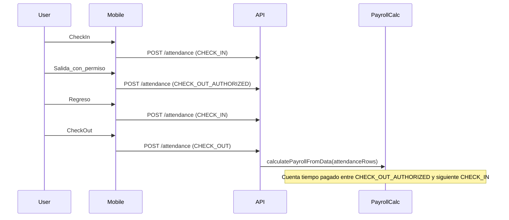

# Puestos: salario por periodo + Asistencia: salida autorizada

## Objetivo

- En `[apps/web/app/(dashboard)/job-positions/](apps/web/app/\\(dashboard)/job-positions/)`, reemplazar el input de **salario diario** por **salario total del periodo** según la `paymentFrequency` (Semanal/Quincenal/Mensual), y **derivar `dailyPay`** usando divisores fijos **7 / 14 / 30**.
- Validar **salario mínimo** usando la lógica/legalidad del backend y **actuar según Payroll Settings** (usar `payroll_setting.overtimeEnforcement` como política WARN/BLOCK para esta regla).
- Agregar un tercer tipo de evento de asistencia: **`CHECK_OUT_AUTHORIZED`** (salida con permiso RH) que en nómina **cuenta como tiempo pagado solo hasta el siguiente `CHECK_IN`**.
- Actualizar DB schema/migración, API validation, cálculo de nómina, UI web de asistencia, tipos compartidos, y crear documentación para integrar en mobile.

## 1) Web: Puestos de trabajo (captura salario por periodo)

**Archivos:**

- `[apps/web/app/(dashboard)/job-positions/job-positions-client.tsx](apps/web/app/\\(dashboard)/job-positions/job-positions-client.tsx)`
- [`apps/web/messages/es.json`](apps/web/messages/es.json)

**Cambios:**

- Cambiar el modelo del form de `dailyPay` → `periodPay` (monto total por periodo) y mantener `paymentFrequency`.
- Agregar helpers tipados + JSDoc dentro del archivo:
    - `getPayPeriodDivisor(frequency)` → `7 | 14 | 30`
    - `calculateDailyPayFromPeriodPay(periodPay, frequency)` → redondeo a 2 decimales
    - `calculatePeriodPayFromDailyPay(dailyPay, frequency)` → para precargar edición
- UI:
    - Mostrar select de `paymentFrequency` y después el input **“Salario del periodo (MXN)”** (etiqueta dinámica: semanal/quincenal/mensual).
    - Mostrar preview read-only: **salario diario calculado** (y opcionalmente salario por hora usando el divisor de jornada ya usado en nómina si aplica; si no hay divisor en web, mostrar solo `dailyPay`).
- En `onSubmit`, convertir `periodPay`→`dailyPay` y enviar `dailyPay` al API (no cambiar contrato del endpoint de job-positions).
- Actualizar traducciones `JobPositions.fields.*`, `placeholders.*`, `validation.*` para el nuevo input.

## 2) API: Validación de salario mínimo al crear/editar puestos (gobernada por Payroll Settings)

**Archivos:**

- [`apps/api/src/routes/job-positions.ts`](apps/api/src/routes/job-positions.ts)
- (posible util nuevo) [`apps/api/src/utils/minimum-wage.ts`](apps/api/src/utils/minimum-wage.ts)
- [`apps/api/src/utils/mexico-labor-constants.js`](apps/api/src/utils/mexico-labor-constants.js) (solo para reutilizar `MINIMUM_WAGES`)

**Cambios:**

- En `POST /job-positions` y `PUT /job-positions/:id`:
    - Resolver `organizationId` como hoy.
    - Leer `payroll_setting.overtimeEnforcement` (default `WARN`).
    - Determinar el/los `geographicZone` presentes en la organización via tabla `location`.
        - Si la org aún no tiene ubicaciones, usar fallback `GENERAL`.
    - Calcular `minimumRequiredDailyPay = max(MINIMUM_WAGES[zone])` para esos zones.
    - Si `dailyPay < minimumRequiredDailyPay`:
        - Si `overtimeEnforcement === 'BLOCK'`: rechazar con `400` y payload con un **código machine-readable** (p.ej. `{ error: 'BELOW_MINIMUM_WAGE', details: {...} }`).
        - Si `WARN`: permitir guardar y devolver `warnings: [{ code: 'BELOW_MINIMUM_WAGE', details: {...} }] `junto con `data`.

**Nota UI/i18n:** la UI no debe mostrar strings hardcodeadas; por eso el API debe devolver **códigos** + detalles, no textos para el usuario.

## 3) Web: manejar warnings/errores de salario mínimo en Puestos

**Archivos:**

- [`apps/web/actions/job-positions.ts`](apps/web/actions/job-positions.ts)
- `[apps/web/app/(dashboard)/job-positions/job-positions-client.tsx](apps/web/app/\\(dashboard)/job-positions/job-positions-client.tsx)`
- [`apps/web/messages/es.json`](apps/web/messages/es.json)

**Cambios:**

- Cambiar el patrón de `actions/job-positions.ts` a **errorCode/warnings** (como `actions/locations.ts`):
    - `MutationResult` con `errorCode?: 'BAD_REQUEST' | 'FORBIDDEN' | 'NOT_FOUND' | 'BELOW_MINIMUM_WAGE' | 'UNKNOWN'` y `warnings?: ...`.
    - Si el API retorna `{ error: 'BELOW_MINIMUM_WAGE' }`, mapearlo a `errorCode: 'BELOW_MINIMUM_WAGE'`.
    - Si retorna `warnings`, propagar.
- En el client:
    - Si `result.success` pero `warnings` incluye `BELOW_MINIMUM_WAGE`, mostrar `toast.warning(...)` con traducción.
    - Si `errorCode === 'BELOW_MINIMUM_WAGE'`, mostrar `toast.error(...)` con traducción.
- Agregar traducciones nuevas bajo `JobPositions.toast` / `JobPositions.validation` (p.ej. `belowMinimumWageWarning`, `belowMinimumWageBlocked`).

## 4) DB + API: nuevo tipo de asistencia `CHECK_OUT_AUTHORIZED`

**Archivos:**

- [`apps/api/src/db/schema.ts`](apps/api/src/db/schema.ts)
- Nueva migración SQL en [`apps/api/drizzle/`](apps/api/drizzle/) (siguiente número disponible)
- [`apps/api/src/schemas/crud.ts`](apps/api/src/schemas/crud.ts)

**Cambios:**

- Extender enum `attendance_type`:
    - En Drizzle schema: `pgEnum('attendance_type', ['CHECK_IN','CHECK_OUT','CHECK_OUT_AUTHORIZED'])`.
    - Migración: `ALTER TYPE attendance_type ADD VALUE 'CHECK_OUT_AUTHORIZED';`.
- Actualizar zod `attendanceTypeEnum` para aceptar el nuevo valor.

## 5) API: nómina debe contar salida autorizada como tiempo pagado hasta el siguiente CHECK_IN

**Archivos:**

- [`apps/api/src/services/payroll-calculation.ts`](apps/api/src/services/payroll-calculation.ts)
- [`apps/api/src/services/payroll-calculation.test.ts`](apps/api/src/services/payroll-calculation.test.ts)

**Cambios:**

- Tipos:
    - `AttendanceRow.type` y `EmployeeAttendanceRow.type` incluyen `CHECK_OUT_AUTHORIZED`.
- Algoritmo (estado):
    - Cuando ocurre `CHECK_OUT_AUTHORIZED` con un `openCheckIn`, cerrar el tramo trabajado y activar `paidExitStart = timestamp`.
    - Cuando ocurre el siguiente `CHECK_IN` y hay `paidExitStart`, agregar minutos pagados entre `paidExitStart` y ese `CHECK_IN` (con el mismo clipping a `periodBounds`) y limpiar `paidExitStart`.
    - Mantener la lógica existente de corte por día (`addWorkedMinutesByDateKey`).
- Test nuevo:
    - Caso: `CHECK_IN 09:00` → `CHECK_OUT_AUTHORIZED 11:00` → `CHECK_IN 13:00` → `CHECK_OUT 18:00` debe contar 9h (incluyendo 2h “afuera con permiso”).

## 6) Web: UI de asistencia debe mostrar/filtrar el nuevo tipo

**Archivos:**

- [`apps/web/lib/client-functions.ts`](apps/web/lib/client-functions.ts)
- `[apps/web/app/(dashboard)/attendance/attendance-client.tsx](apps/web/app/\\(dashboard)/attendance/attendance-client.tsx)`
- [`apps/web/messages/es.json`](apps/web/messages/es.json)

**Cambios:**

- Extender `AttendanceType` en web.
- Ajustar:
    - `typeVariants` para incluir `CHECK_OUT_AUTHORIZED`.
    - Badge label y CSV export label (nuevo texto: “Salida autorizada (RH)” o similar).
    - Filtro de tipo: agregar opción extra.
- Agregar traducción en `Attendance.typeFilter.*` para el nuevo tipo.

## 7) Tipos compartidos + documentación para mobile

**Archivos:**

- [`packages/types/src/index.ts`](packages/types/src/index.ts)
- Nuevo doc en [`documentacion/`](documentacion/)

**Cambios:**

- Extender `@sen-checkin/types`:
    - `export type AttendanceType = 'CHECK_IN' | 'CHECK_OUT' | 'CHECK_OUT_AUTHORIZED';`
- Crear doc nuevo (propuesta): `documentacion/asistencia-salida-autorizada-rh.md`:
    - Definir el nuevo tipo, semántica exacta (paga hasta el siguiente `CHECK_IN`), ejemplos de secuencia de eventos.
    - Cómo enviarlo desde mobile: `POST /attendance` con `type: 'CHECK_OUT_AUTHORIZED'` y `metadata` opcional.
    - Implicaciones: no cuenta como “presente” en `/attendance/present` (último evento no es CHECK_IN).

## 8) Verificación final (obligatorio)

- Ejecutar desde la raíz:
    - `bun run lint`
    - `bun run check-types`

Asegurar cumplimiento de: [`AGENTS.md`](AGENTS.md), [`apps/web/docs/data-table-architecture.md`](apps/web/docs/data-table-architecture.md), [`documentacion/release-06-form-architecture.md`](documentacion/release-06-form-architecture.md), [`documentacion/release-04-query-fetch-architecture.md`](documentacion/release-04-query-fetch-architecture.md).

## Diagrama (nuevo evento de asistencia)

