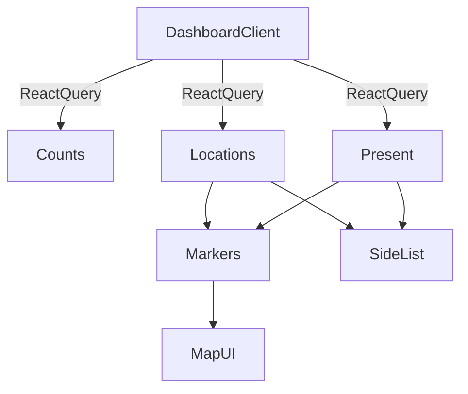

# Dashboard con mapa + flujo de ubicaciones

## Objetivo

- Convertir el dashboard en una vista **mapa a pantalla completa** (protagonista), con:
- **Insights compactos** siempre visibles en la parte superior.
- **Ubicaciones como marcadores** con nombre siempre visible.
- **Hover**: número de empleados presentes.
- **Click**: popup con lista de empleados presentes.
- **Lista vertical** (overlay) con ubicaciones en colapsables y empleados presentes.
- Mejorar el registro/edición de ubicaciones para capturar **lat/lng** vía **búsqueda de dirección (Nominatim) + ajuste en mapa**, guardando coordenadas.

## Reglas / Best practices a seguir

- Seguir estrictamente [`AGENTS.md`](AGENTS.md):
- Seguir explícitamente la arquitectura de queries/fetch/streaming en [`documentacion/release-04-query-fetch-architecture.md`](documentacion/release-04-query-fetch-architecture.md) (queryKeys centralizados, client/server fetchers, prefetch sin `await`, invalidación con `.all`).
- Seguir explícitamente la arquitectura de formularios TanStack Form en [`documentacion/release-06-form-architecture.md`](documentacion/release-06-form-architecture.md) (`useAppForm`, `form.AppField`, componentes de campo/form registrados, validación consistente).
- Si se necesita UI tipo tabla en cualquier parte, usar el componente existente **`DataTable`** (`apps/web/components/data-table/data-table.tsx`) en lugar de crear tablas ad-hoc; para tablas simples reutilizar `apps/web/components/ui/table.tsx`.
- TypeScript estricto, **tipado fuerte** y **JSDoc en todas las funciones**.
- **Cero strings de UI hardcodeadas**: todo en `next-intl` (`apps/web/messages/es.json`) en español.
- Usar **shadcn/ui** para UI (y agregar componentes con CLI si falta).
- Performance/UX:
- Debounce y mínimo de caracteres para geocoding.
- Memoizar derivados (markers, grupos) para evitar renders caros.
- Accesibilidad: labels, aria, estados vacíos claros.

## Documentación y referencias

- **mapcn docs**: `https://mapcn.vercel.app/docs`
- **Instalación mapcn (shadcn registry)**: `https://mapcn.vercel.app/registry/map.json`
- `bunx shadcn@latest add https://mapcn.vercel.app/registry/map.json` (o `npx shadcn@latest add ...`)
- mapcn (Context7) incluye ejemplos con `Map`, `MapMarker`, `MarkerLabel`, `MarkerTooltip`, `MarkerPopup`.
- Arquitectura web: [`documentacion/release-04-query-fetch-architecture.md`](documentacion/release-04-query-fetch-architecture.md)
- Arquitectura de formularios: [`documentacion/release-06-form-architecture.md`](documentacion/release-06-form-architecture.md)

## Cambios de datos (API + DB)

### 1) Añadir coordenadas a `location`

- **DB**: agregar `latitude` y `longitude` (nullable) a la tabla `location`.
- Archivo: [`apps/api/src/db/schema.ts`](apps/api/src/db/schema.ts).
- Crear nueva migración Drizzle en `apps/api/drizzle/`.
- **Validación API**: extender schemas de CRUD.
- Archivo: [`apps/api/src/schemas/crud.ts`](apps/api/src/schemas/crud.ts).
- `createLocationSchema`: `latitude/longitude` opcionales (rango -90..90 / -180..180).
- `updateLocationSchema`: permitir setear `latitude/longitude` (opcional; si se quiere “borrar”, permitir `null`).
- **Routes**: persistir y devolver campos.
- Archivo: [`apps/api/src/routes/locations.ts`](apps/api/src/routes/locations.ts).

### 2) Tipos compartidos

- Actualizar `Location` en [`packages/types/src/index.ts`](packages/types/src/index.ts) para incluir `latitude/longitude` (nullable), manteniendo compatibilidad.

## Geocoding (Nominatim) en Web

### 3) Endpoint proxy (server-side) para autocomplete

- Crear route handler:
- Archivo: [`apps/web/app/api/geocode/route.ts`](apps/web/app/api/geocode/route.ts).
- Función:
- Aceptar query `q`.
- Validar: mínimo 3 caracteres.
- Hacer fetch a Nominatim `search` (sin API key), con `accept-language=es` y `limit`.
- Normalizar respuesta a un tipo propio: `{ displayName, lat, lng }[]`.
- Añadir caching razonable (por ejemplo `revalidate`) y manejo de errores consistente.

## Mejoras UX/UI en registro de ubicaciones

### 4) Formulario de ubicación (crear/editar) con búsqueda + mapa

- Archivo: `[apps/web/app/(dashboard)/locations/locations-client.tsx](apps/web/app/\\\\(dashboard)/locations/locations-client.tsx)`.
- Cambios:
- Extender `LocationFormValues` con `latitude: number | null` y `longitude: number | null`.
- Reemplazar “Dirección” por un **combobox de búsqueda** (shadcn `Popover` + `Command`) consumiendo `/api/geocode`.
- Al seleccionar un resultado:
    - llenar `address` con `displayName`.
    - setear `latitude/longitude`.
- “Ajustar en mapa”:
    - Renderizar un mapa pequeño (mapcn `Map`) dentro del diálogo.
    - Mostrar un `MapMarker` en las coords actuales.
    - Permitir **click en el mapa** para mover el marcador (y actualizar lat/lng). Si mapcn no expone `onClick` directamente, usar el hook/escape hatch de MapLibre que mapcn provea (se verificará en el código generado por el registry).
- Mostrar estado cuando faltan coords:
    - La ubicación se puede guardar, pero se mostrará en dashboard bajo “Sin coordenadas” y **no** como marcador.
- Mejorar feedback:
    - Errores/toasts 100% en español vía `next-intl`.
    - (Recomendado) Cambiar `apps/web/actions/locations.ts` para devolver `errorCode` en lugar de strings en inglés, y mapearlo a mensajes i18n.

### 5) Acciones server-side de ubicaciones

- Archivo: [`apps/web/actions/locations.ts`](apps/web/actions/locations.ts).
- Incluir `latitude/longitude` en `CreateLocationInput`/`UpdateLocationInput` y enviarlos a la API.

## Refactor de Dashboard: mapa full-page + overlays

### 6) Layout: mapa protagonista y overlays siempre visibles

- Archivo: `[apps/web/app/(dashboard)/dashboard/dashboard-client.tsx](apps/web/app/\\\\(dashboard)/dashboard/dashboard-client.tsx)`.
- Reemplazar la UI actual por una estructura “map-first”:
- Contenedor `relative` que anule el padding del `<main>` (`-m-6`) y use altura de viewport para evitar scroll.
- `Map` a `absolute inset-0`.
- Overlays:
    - **Barra de insights** arriba (compacta): counts + acciones rápidas.
    - **Panel lateral** vertical con ubicaciones (colapsables + búsqueda).

### 7) Datos y composición

- Mantener `counts` (React Query suspense) y `presentRecords`.
- Agregar query para traer **todas** las ubicaciones del org (paginando internamente si excede 100):
- Usar `fetchLocationsList` en loop hasta completar `total`.
- Derivados:
- `presentByLocationId: Map<string, AttendancePresentRecord[]>`.
- `locationsWithCoords` vs `locationsWithoutCoords`.

### 8) Marcadores

- Por cada ubicación con coords:
- `MapMarker(longitude, latitude)`
- `MarkerLabel`: nombre siempre visible.
- `MarkerTooltip`: “{n} presentes”.
- `MarkerPopup`: lista de empleados presentes (shadcn `Card`, `ScrollArea`, `Avatar`, etc.).

### 9) Lista lateral (overlay)

- Panel con:
- Buscador.
- Sección colapsable de ubicaciones con coords.
- Sección “Sin coordenadas” (solo lista; sin marcador) con CTA “Editar ubicación” (link a `/locations` con intención de editar).
- Al abrir un item:
- Mostrar empleados presentes.
- (Nice-to-have) centrar el mapa en la ubicación seleccionada.

## Integración mapcn + shadcn

- Añadir componentes mapcn via shadcn:
- `npx shadcn@latest add https://mapcn.vercel.app/registry/map.json` (o equivalente con `bunx`).
- Verificar dependencias (`maplibre-gl`, `next-themes`, etc.) y que el proyecto ya tenga theme provider.
- Añadir estilos globales recomendados para popups en:
- [`apps/web/app/globals.css`](apps/web/app/globals.css).

## i18n (es)

- Agregar/ajustar llaves en [`apps/web/messages/es.json`](apps/web/messages/es.json):
- `Dashboard.*` (insights compactos, estados vacíos, labels de tooltip/popup).
- `Locations.*` (buscador de dirección, estados de coords, helper text).

## Diagrama (flujo)

## Verificaciones al final (obligatorio)