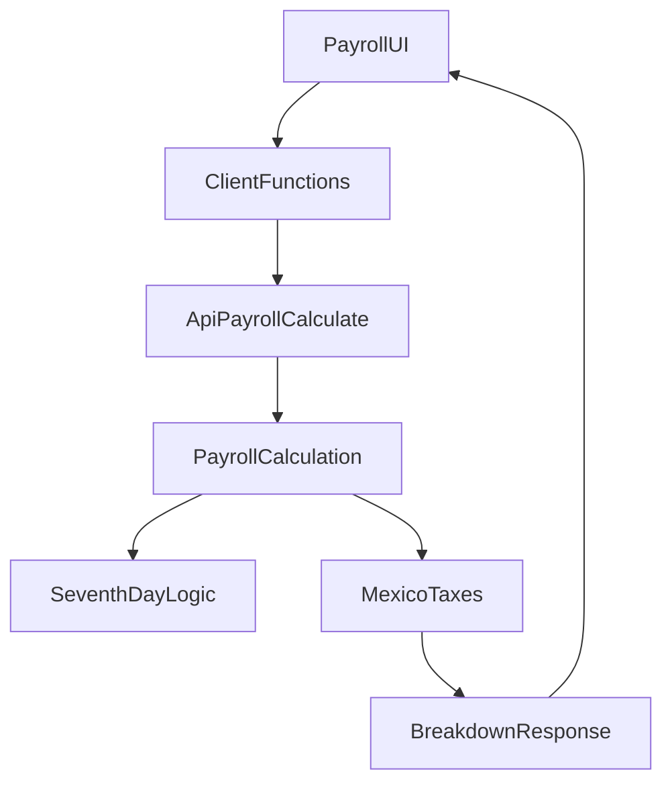

# Upgrade de nómina México (impuestos + séptimo día) con testing robusto

## Reglas de trabajo (obligatorias)

- Seguir `AGENTS.md`: TypeScript estricto, JSDoc en funciones, i18n en español (sin strings hardcodeadas), comandos de repo (`bun run db:gen`, `bun run db:mig`, `bun run test`).

## Decisiones ya confirmadas

- **SBC/SDI**: **Mixto** — calcular automáticamente SDI/SBC desde `dailyPay` + `hireDate` (FI por LFT 2023+), con **override manual por empleado**.
- **Comportamiento del reporte**: replicar `documentacion/impuestos-test.md` — incluir **“Séptimo día”** y soportar **absorción patronal de IMSS obrero e ISR** (desde Payroll Settings).

## Diseño de salida (para evitar bugs)

Ampliar el resultado por empleado para separar:

- **Percepciones (gross)**: cálculo actual + `seventhDayPay`.
- **Retenciones del trabajador** (`employeeWithholdings`): ISR retenido (cuando no se absorbe), IMSS obrero (cuando no se absorbe), etc.
- **Costos del patrón** (`employerCosts`): IMSS patronal, INFONAVIT 5%, SAR 2%, ISN, RT, Guarderías, y _absorciones_ cuando apliquen.
- **Informativos** (`informationalLines`): ISR antes de subsidio, subsidio aplicado, etc.
- **Neto** (`netPay`) y **costo empresa** (`companyCost`).

Esto sigue el criterio de `documentacion/impuestos-mx-detailed.md` (separar deducción vs costo).

## Backend (apps/api)

### 1) Persistencia y configuración

- **DB/Drizzle**
- Actualizar [`apps/api/src/db/schema.ts`](apps/api/src/db/schema.ts):
    - `payroll_setting`: agregar campos fiscales (por organización):
    - `riskWorkRate` (prima RT), `statePayrollTaxRate` (ISN),
    - `absorbImssEmployeeShare`, `absorbIsr`,
    - `aguinaldoDays`, `vacationPremiumRate`, `enableSeventhDayPay`.
    - `employee`: agregar `sbcDailyOverride` (nullable). Usar `hireDate` (ya existe).
    - `payroll_run` y `payroll_run_employee`: agregar columnas/snapshot (`jsonb`) para breakdown fiscal y totales (para auditoría y consistencia histórica).
- Crear migración en `apps/api/drizzle/` (vía `bun run db:gen` + `bun run db:mig`).
- **Schemas/validación**
- Extender [`apps/api/src/schemas/payroll.ts`](apps/api/src/schemas/payroll.ts) para settings + response extendida.
- Extender [`apps/api/src/schemas/crud.ts`](apps/api/src/schemas/crud.ts) para aceptar `hireDate` y `sbcDailyOverride` en empleados.

### 2) Motor fiscal México (cálculo)

- Implementar módulo nuevo:
- [`apps/api/src/services/mexico-payroll-taxes.ts`](apps/api/src/services/mexico-payroll-taxes.ts)
- [`apps/api/src/utils/money.ts`](apps/api/src/utils/money.ts) (céntimos/rounding)

Debe cubrir:

- **SDI/SBC automático (LFT 2023+)**
- FI: \(FI = (365 + aguinaldoDays + vacationDays \* vacationPremiumRate) / 365\)
- Vacaciones por años cumplidos (tabla nueva) y cálculo determinista por fecha (usar periodo para decidir años).
- `sbcDaily = sbcDailyOverride ?? (dailyPay * FI)`.
- **ISR + subsidio al empleo (2025)**
- Tarifas ISR 2025 (semanal/quincenal/mensual) conforme a `documentacion/impuestos-mx.md`.
- Subsidio 2025: usar **475.00** mensual y prorrateo diario `475/30.4`.
- Exponer en resultado: `isrBeforeSubsidy`, `subsidyApplied`, `isrWithheld`.
- **IMSS + SAR + INFONAVIT + ISN**
- IMSS: E&M cuota fija (UMA), PD, GMP, IV, CV (patronal 2025 por rango) + CV obrero 1.125%.
- Guarderías 1% (separado).
- SAR Retiro 2%.
- INFONAVIT 5%.
- ISN: por tasa configurada, base por defecto `grossPay`.
- RT: `sbcPeriod * riskWorkRate`.
- **Absorciones (seguras y explícitas)**
- Si `absorbImssEmployeeShare`: mover IMSS obrero y CV obrero a `employerCosts` (y dejar `employeeWithholdings` en 0 para esos rubros).
- Si `absorbIsr`: mover `isrWithheld` a `employerCosts` (y dejar `employeeWithholdings.isrWithheld` en 0).
- Dejar advertencia técnica (en comentarios) sobre gross-up como follow-up; para este release replicamos el reporte (sin gross-up).

### 3) Integración con nómina existente

- Actualizar [`apps/api/src/services/payroll-calculation.ts`](apps/api/src/services/payroll-calculation.ts):
- Agregar cálculo de **séptimo día**:
    - Gate por settings `enableSeventhDayPay`.
    - Solo para `WEEKLY` y periodos de 7 días.
    - Regla determinista basada en `employee_schedule` + asistencia (para empatar el reporte semanal).
- Invocar el motor fiscal para producir breakdown por empleado + totales agregados.
- Actualizar [`apps/api/src/routes/payroll.ts`](apps/api/src/routes/payroll.ts):
- Seleccionar `hireDate` y `sbcDailyOverride`.
- Incluir settings fiscales al llamar al cálculo.
- En `/payroll/process`, persistir snapshot fiscal y totales.
- Actualizar [`apps/api/src/routes/payroll-settings.ts`](apps/api/src/routes/payroll-settings.ts) para GET/PUT con defaults fiscales.

## Frontend (apps/web)

### 4) Tipos, fetchers y actions

- Actualizar [`apps/web/lib/client-functions.ts`](apps/web/lib/client-functions.ts):
- `PayrollSettings` y `PayrollCalculationEmployee/Result` para nuevos campos.
- Normalización numérica (strings provenientes de `numeric`).
- Actualizar actions:
- [`apps/web/actions/payroll.ts`](apps/web/actions/payroll.ts) para enviar/guardar settings fiscales.
- [`apps/web/actions/employees.ts`](apps/web/actions/employees.ts) para enviar `hireDate` y `sbcDailyOverride`.

### 5) UI: Payroll Settings

- Extender `[apps/web/app/(dashboard)/payroll-settings/payroll-settings-client.tsx](apps/web/app/\\(dashboard)/payroll-settings/payroll-settings-client.tsx) `siguiendo `documentacion/release-06-form-architecture.md`:
- Inputs de tasas/flags: RT, ISN, aguinaldo, prima vacacional, toggles de absorción, toggle séptimo día.
- i18n en [`apps/web/messages/es.json`](apps/web/messages/es.json).

### 6) UI: Employees (override + fecha)

- Extender `[apps/web/app/(dashboard)/employees/employees-client.tsx](apps/web/app/\\(dashboard)/employees/employees-client.tsx)`:
- Capturar `hireDate`.
- Campo opcional `sbcDailyOverride` (con helper y validación).
- i18n en `apps/web/messages/es.json`.

### 7) UI: Payroll

- Mantener la tabla actual y UX.
- Agregar “Resumen fiscal” (gross, retenciones, neto, costos patrón, costo empresa) y un detalle por empleado (Dialog/Accordion) con breakdown IMSS/ISR/INFONAVIT/SAR/ISN.
- Archivo: `[apps/web/app/(dashboard)/payroll/payroll-client.tsx](apps/web/app/\\(dashboard)/payroll/payroll-client.tsx)` + traducciones.

## Testing (apps/api) — requisito explícito: 2 corridas

Actualizar [`apps/api/src/services/payroll-calculation.test.ts`](apps/api/src/services/payroll-calculation.test.ts) usando `documentacion/impuestos-test.md` como base.

### Caso principal: Semana 51 (15/Dic/2025 al 21/Dic/2025)

- Preparar datos:
- 2 empleados con `dailyPay=278.80`, `paymentFrequency=WEEKLY`, `shiftType=DIURNA`.
- `hireDate`:
    - emp 002: 2020-11-09 → FI debe producir `SBC_d=294.08`.
    - emp 003: 2022-01-04 → FI debe producir `SBC_d=293.31`.
- Schedule Lun–Sáb 8h, domingo descanso.
- Attendance Lun–Sáb (para habilitar “séptimo día”).
- Settings fiscales:
    - `enableSeventhDayPay=true`
    - `riskWorkRate=0.06`
    - `statePayrollTaxRate=0.02`
    - UMA 2025 = 113.14 (constante del motor).

### Corrida A (con absorción): absorbImssEmployeeShare=true, absorbIsr=true

Asserts **duros** (no derivados del mismo código) para evitar regresiones:

- **Séptimo día**: `grossPayEmpleado=1951.60` (6 días sueldo + 1 día séptimo).
- **ISR+subsidio** (informativo):
- `isrBeforeSubsidy=139.32`, `subsidyApplied=109.38`, `isrWithheld=29.94`.
- **Retenciones**: `employeeWithholdings.total=0.00` (por absorción).
- **Obligaciones patrón** (deben igualar el reporte):
- SAR 2% = 82.23
- ISN 2% = 78.06
- RT = 246.70
- IMSS (bloque empresa) = 782.90 con rubros:
    - E&G (cuota fija UMA) = 323.12
    - E&G (Din. y Gastos) = 97.66
    - Invalidez y Vida = 97.65
    - Cesantía y Vejez = 264.47
- INFONAVIT 5% = 205.59
- Guarderías 1% = 41.12
- Total obligaciones = 1436.60
- **Neto**: `netPayEmpleado=1951.60` y `netPayTotal=3903.20`.

### Corrida B (sin absorción): absorbImssEmployeeShare=false, absorbIsr=false

Asserts **completos**:

- **ISR retenido** debe ahora ir en `employeeWithholdings` (29.94 por empleado).
- **IMSS obrero + CV obrero** por empleado (valores esperados a 2 decimales):
- emp 002: 48.89
- emp 003: 48.76
- **Neto** por empleado:
- emp 002: 1872.77
- emp 003: 1872.90
- **IMSS empresa** (sin parte obrera) esperado: 685.25
- **Comparativos**: asegurar que
- `companyCostAbsorcion > companyCostSinAbsorcion` y
- `netPayAbsorcion > netPaySinAbsorcion`.

### Cobertura extra (para ser “lo más completo posible”)

- Test de override: asignar `sbcDailyOverride` y verificar que domina el cálculo automático.
- Test de “séptimo día no aplica”: quitar un día de asistencia y verificar `seventhDayPay=0`.
- Validar invariantes:
- `grossPay = percepciones`.
- `netPay = grossPay - employeeWithholdings.total`.
- `companyCost = grossPay + employerCosts.total`.
- Todos los importes con 2 decimales (rounding consistente).

## Verificación final (requisito)

- Al final de la implementación, ejecutar **`bun run test`** (script del `package.json` raíz) para correr Turbo y validar `apps/api` (`bun test`).

