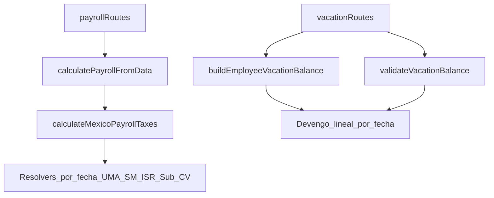

# Actualización Nómina & Vacaciones (MX) 2026

## Contexto y objetivo

- Actualizar el cálculo de nómina para soportar **rulings 2026** (UMA, salario mínimo, tablas ISR 2026, Subsidio al empleo 2026, y tasas patronales C&V 2026) **sin romper** el fixture histórico de **Periodo 51 (Dic 2025)**.
- Actualizar el módulo de vacaciones para **devengo lineal** y **enforcement** (no permitir solicitudes que excedan lo devengado), alineado a `documentacion/vacaciones_mx_lft_guia_2026.md`.
- Entregar un **reporte técnico** en `documentacion/` describiendo cambios y recordando que el agente debe seguir `AGENTS.md` y ejecutar `bun run lint` + `bun run check-types`.

## Descubrimientos clave (estado actual)

- El cálculo fiscal MX vive en [`apps/api/src/services/mexico-payroll-taxes.ts`](apps/api/src/services/mexico-payroll-taxes.ts) y hoy está hardcodeado a valores tipo “2025” (ISR tablas, subsidio, UMA, C&V).
- Hay un test de regresión que replica el reporte CONTPAQi del **Periodo 51 (15–21 Dic 2025)** en [`apps/api/src/services/payroll-calculation.test.ts`](apps/api/src/services/payroll-calculation.test.ts), que debemos preservar.
- Salario mínimo está hardcodeado como **CONASAMI 2025** en [`apps/api/src/utils/mexico-labor-constants.ts`](apps/api/src/utils/mexico-labor-constants.ts).
- Vacaciones: el conteo de días (no contar descansos/feriados obligatorios) ya existe en [`apps/api/src/services/vacations.ts`](apps/api/src/services/vacations.ts), pero el balance usa un modelo “asignado anual” en [`apps/api/src/services/vacation-balance.ts`](apps/api/src/services/vacation-balance.ts).

## Plan de implementación

### 1) Nómina: parámetros por vigencia (2025 vs 2026)

- En [`apps/api/src/services/mexico-payroll-taxes.ts`](apps/api/src/services/mexico-payroll-taxes.ts):
    - Crear datasets versionados y resolvers “por fecha” para:
        - **UMA diaria** (de `nomina_mx_imss_infonavit_isr_sar_2026.md` + `nomina_mx_imss_infonavit_isr_sar_2026 (1).md`):
            - 113.14 hasta 2026-01-31
            - 117.31 desde 2026-02-01
        - **Salario mínimo diario por zona**:
            - 2025 (GENERAL 278.80, ZLFN 419.88)
            - 2026 (GENERAL 315.04, ZLFN 440.87)
        - **Tablas ISR 2026** (WEEKLY/BIWEEKLY/MONTHLY) desde `nomina_mx_imss_infonavit_isr_sar_2026.md`.
        - **Subsidio al empleo 2026** (límite mensual 11,492.66; máximos mensuales por vigencia) y prorrateo /30.4.
        - **C&V patronal 2026** usando como fuente de verdad `documentacion/nomina_mx_imss_infonavit_isr_sar_2026 (1).md` (selección confirmada).
    - Ajustar `calculateMexicoPayrollTaxes()` para:
        - Iterar por `dateKey` del periodo (inclusive) y **sumar bases por día** cuando dependan de UMA (tope 25 UMA, excedente 3 UMA, cuota fija E&M, subsidio diario). Esto permite periodos que crucen 01-feb.
        - Mantener la misma estrategia de redondeo actual (`roundCurrency` por concepto y totales desde sumas raw) para conservar el match del fixture 2025.
        - Seleccionar la **tabla ISR** por vigencia usando `periodEndDateKey` como “fecha efectiva” del periodo.

### 2) Nómina: salario mínimo por fecha (warnings)

- En [`apps/api/src/services/payroll-calculation.ts`](apps/api/src/services/payroll-calculation.ts):
    - Cambiar el warning `BELOW_MINIMUM_WAGE` para validar contra el salario mínimo **vigente en `periodEndDateKey`** (zona GENERAL/ZLFN).
- En [`apps/api/src/utils/minimum-wage.ts`](apps/api/src/utils/minimum-wage.ts):
    - Agregar un helper tipado para resolver salario mínimo por `dateKey` + zona (manteniendo compatibilidad con usos actuales).

### 3) Tests de nómina (fixtures 2025 + casos 2026)

- Mantener el test “Periodo 51” como regresión contra:
    - `documentacion/reporte_raya_periodo51_tablas_2026.md`
    - `documentacion/simulacion_corrida_periodo51_2026.md`
- Agregar nuevos tests (en el mismo archivo o uno dedicado) que verifiquen:
    - **Tablas ISR 2026** (p.ej. WEEKLY con base 1951.60 → ISR antes esperado)
    - **Subsidio**: diferencia **enero 2026 vs feb 2026** (máximo mensual y prorrateo)
    - **UMA switch**: `bases.umaDaily` y/o componentes dependientes (E&M cuota fija) cambian al cruzar 01-feb-2026.

### 4) Vacaciones: devengo lineal + enforcement

- En [`apps/api/src/services/vacation-balance.ts`](apps/api/src/services/vacation-balance.ts):
    - Implementar cálculo de **devengo lineal** (usando días reales del “año vacacional” del servicio) y actualizar:
        - `accruedDays`: días devengados al corte.
        - `availableDays`: `floor(accruedDays) - used - pending` (clamp ≥ 0) para enforcement con días enteros.
    - Ajustar `serviceYearStartDateKey` / `serviceYearEndDateKey` para representar el rango del año vacacional vigente (último aniversario → siguiente aniversario).
- En [`apps/api/src/routes/vacations.ts`](apps/api/src/routes/vacations.ts):
    - Actualizar `validateVacationBalance()` para validar contra días **devengados** (as-of `endDateKey` de la solicitud) por `serviceYearNumber`.

### 5) Tipos compartidos + UI (web)

- En [`packages/types/src/index.ts`](packages/types/src/index.ts):
    - Extender `EmployeeVacationBalance` para incluir `accruedDays` (y mantener `entitledDays`).
- En web:
    - Actualizar el tipo `VacationBalance` en [`apps/web/lib/client-functions.ts`](apps/web/lib/client-functions.ts).
    - Actualizar tooltip/labels en [`apps/web/messages/es.json`](apps/web/messages/es.json) para reflejar la nueva fórmula (Disponibles = Devengados - Usados - Pendientes) y mostrar `accruedDays`.
    - Ajustar cualquier render que asuma enteros/semántica previa.

### 6) Reporte de implementación

- Crear `documentacion/reporte-implementacion-nomina-vacaciones-2026.md` con:
    - Qué cambió en nómina (UMA/SM/tablas ISR/Subsidio/C&V) y cómo se resolvió por fecha.
    - Qué cambió en vacaciones (devengo/enforcement, impacto en balance y validación).
    - Tests agregados/actualizados.
    - Recordatorio explícito: **seguir `AGENTS.md`** y ejecutar **`bun run lint`** + **`bun run check-types`** (y los comandos scoped si aplica).

## Diagrama (alto nivel)

## Comandos de calidad (al finalizar)

- `bun run lint`
- `bun run check-types`

(Se documentarán también en el reporte final en `documentacion/`.)
