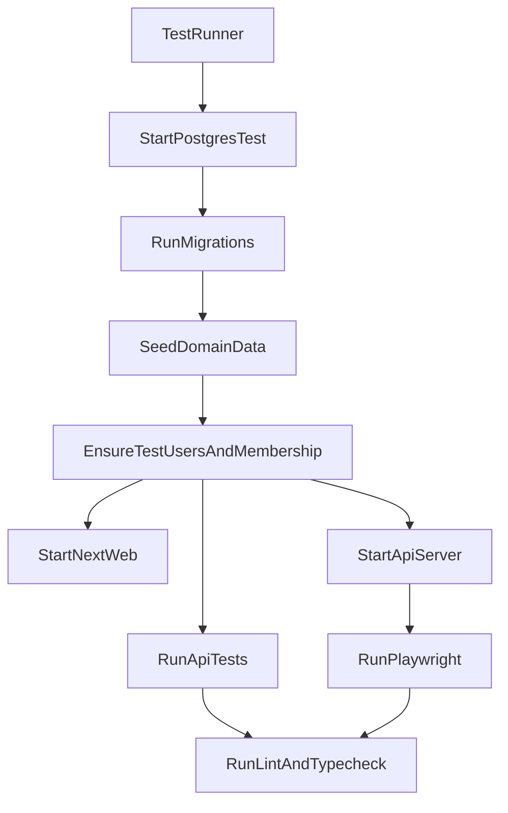

# Integrar testing en `apps/api` y `apps/web`

## Objetivos

- **API (`apps/api`)**: implementar el patrón de pruebas de Elysia (Request/Response + `Elysia.handle`) y **Eden Treaty unit tests** (cliente typed contra la instancia de app), cubriendo **todos los endpoints de negocio** y además los **flujos core de BetterAuth** bajo `/api/auth/*`.
- **Web (`apps/web`)**: integrar **Playwright** para E2E de los flujos críticos (mínimo: **login** y **navegación por roles**) y **Vitest** para pruebas unitarias de lógica/componentes importantes.
- **Automatización**: scripts para correr suites en local/CI, y al final ejecutar **lint** y **check-types**.

## Alcance confirmado

- API: **híbrido** (tests completos + algunos smokes de integración) y **BetterAuth core** incluido.
- Web E2E: **local automatizado** (DB docker + seed + usuarios de prueba con defaults).

## Diseño de alto nivel

## Cambios planeados — API (`apps/api`)

### 1) Hacer la app “testeable” sin side-effects

- Crear un factory **sin `listen()`** en [`apps/api/src/app.ts`](apps/api/src/app.ts) que construya la app con los plugins/rutas.
- Ajustar [`apps/api/src/index.ts`](apps/api/src/index.ts) para solo arrancar el servidor al ejecutarse como entrypoint (y re-exportar tipos necesarios).
    - Mantener `export type App = ...` para que [`packages/api-contract/src/index.ts`](packages/api-contract/src/index.ts) siga funcionando con Treaty.

### 2) Dependencias y scripts

- Agregar `@elysiajs/eden` como devDependency en [`apps/api/package.json`](apps/api/package.json) para poder usar `treaty(app)` en tests.
- Separar tests **unitarios** vs **contract/integración** por patrón de nombre:
    - `*.unit.test.ts`: sin Postgres (mocks), rápidos.
    - `*.contract.test.ts`: DB-backed (docker), cubren endpoints completos.
- Scripts propuestos en [`apps/api/package.json`](apps/api/package.json):
    - `test:unit` → `bun test "src/**/*.unit.test.ts"`
    - `test:contract` → `bun test "src/**/*.contract.test.ts"`
    - `test` → `bun run test:unit` (para que `turbo run test` sea rápido)
    - `test:ci` → bootstrap DB + `test:unit` + `test:contract`

### 3) Bootstrap reproducible para DB de tests

- Añadir un compose separado para no tocar tu DB de dev:
    - [`apps/api/docker-compose.test.yaml`](apps/api/docker-compose.test.yaml)
- Añadir script de bootstrap:
    - [`apps/api/scripts/test/bootstrap.ts`](apps/api/scripts/test/bootstrap.ts)
    - Responsabilidades:
        - Levantar Postgres de tests.
        - Exportar/validar `SEN_DB_URL`.
        - Correr migraciones (`drizzle-kit migrate`).
        - Ejecutar seed existente [`apps/api/scripts/seed.ts`](apps/api/scripts/seed.ts).
        - Crear/actualizar usuarios E2E con defaults (admin + user) y membresías.

### 4) Tests de endpoints (Elysia.handle + Eden Treaty)

- Implementar suite por archivo de rutas (todas en `apps/api/src/routes/*`):
    - [`apps/api/src/routes/attendance.contract.test.ts`](apps/api/src/routes/attendance.contract.test.ts)
    - [`apps/api/src/routes/devices.contract.test.ts`](apps/api/src/routes/devices.contract.test.ts)
    - [`apps/api/src/routes/employees.contract.test.ts`](apps/api/src/routes/employees.contract.test.ts)
    - [`apps/api/src/routes/job-positions.contract.test.ts`](apps/api/src/routes/job-positions.contract.test.ts)
    - [`apps/api/src/routes/locations.contract.test.ts`](apps/api/src/routes/locations.contract.test.ts)
    - [`apps/api/src/routes/organization.contract.test.ts`](apps/api/src/routes/organization.contract.test.ts)
    - [`apps/api/src/routes/payroll-settings.contract.test.ts`](apps/api/src/routes/payroll-settings.contract.test.ts)
    - [`apps/api/src/routes/payroll.contract.test.ts`](apps/api/src/routes/payroll.contract.test.ts)
    - [`apps/api/src/routes/schedule-templates.contract.test.ts`](apps/api/src/routes/schedule-templates.contract.test.ts)
    - [`apps/api/src/routes/schedule-exceptions.contract.test.ts`](apps/api/src/routes/schedule-exceptions.contract.test.ts)
    - [`apps/api/src/routes/scheduling.contract.test.ts`](apps/api/src/routes/scheduling.contract.test.ts)
    - [`apps/api/src/routes/vacations.contract.test.ts`](apps/api/src/routes/vacations.contract.test.ts)
    - [`apps/api/src/routes/recognition.contract.test.ts`](apps/api/src/routes/recognition.contract.test.ts)

- Cada endpoint tendrá al menos:
    - **código esperado** (200/201/400/401/403/404/409 según caso)
    - **error/warning payload** (mensaje claro; en payroll/vacations validar warnings relevantes)
    - **type-safety**: llamadas usando `treaty(app)` sin `any` (errores se prueban con inputs semánticamente inválidos pero tipados, p.ej. UUID inválido como `string`).

- Mantener y renombrar el test existente de payroll como unitario:
    - [`apps/api/src/routes/payroll.test.ts`](apps/api/src/routes/payroll.test.ts) → `payroll.unit.test.ts`

### 5) BetterAuth core: smoke/contract tests

- Crear [`apps/api/src/auth/auth-core.contract.test.ts`](apps/api/src/auth/auth-core.contract.test.ts) que verifique (mínimo):
    - `signUpEmail` / `signInEmail` (cookie/estado)
    - `getSession`
    - `organization.list` + `organization.setActive`
    - `apiKey` flujo básico (crear/listar/verificar)
    - `deviceAuthorization` endpoints básicos (si aplica) o al menos que respondan con códigos correctos

> Nota: Para endpoints que requieren AWS Rekognition, los tests mockearán [`apps/api/src/services/rekognition.ts`](apps/api/src/services/rekognition.ts) para no exigir credenciales AWS.

## Cambios planeados — Web (`apps/web`)

### 6) Vitest (unit tests)

- Agregar dependencias y configuración:
    - [`apps/web/vitest.config.ts`](apps/web/vitest.config.ts)
    - [`apps/web/vitest.setup.ts`](apps/web/vitest.setup.ts)
- Agregar scripts en [`apps/web/package.json`](apps/web/package.json):
    - `test` → `vitest run`
    - `test:watch` → `vitest`
- Tests propuestos (alto impacto):
    - [`apps/web/components/organization-gate.test.tsx`](apps/web/components/organization-gate.test.tsx) (restricción/redirect por rutas admin)
    - [`apps/web/components/app-sidebar.test.tsx`](apps/web/components/app-sidebar.test.tsx) (visibilidad de navegación admin según `isSuperUser`/`organizationRole`)

### 7) Playwright (E2E)

- Agregar Playwright y config:
    - [`apps/web/playwright.config.ts`](apps/web/playwright.config.ts)
    - [`apps/web/e2e/global-setup.ts`](apps/web/e2e/global-setup.ts) (llama bootstrap de DB + arranca API)
    - [`apps/web/e2e/auth-login.spec.ts`](apps/web/e2e/auth-login.spec.ts)
    - [`apps/web/e2e/role-navigation.spec.ts`](apps/web/e2e/role-navigation.spec.ts)
- Scripts en [`apps/web/package.json`](apps/web/package.json):
    - `test:e2e` → `playwright test`
    - `test:e2e:ui` → `playwright test --ui`

- Para robustez E2E, añadir `data-testid` (no visible) en:
    - [`apps/web/app/(auth)/sign-in/page.tsx`](<apps/web/app/(auth)/sign-in/page.tsx>)
    - [`apps/web/components/app-sidebar.tsx`](apps/web/components/app-sidebar.tsx)

## Scripts raíz y validación final

- Agregar scripts en [`package.json`](package.json):
    - `test:web:unit` / `test:web:e2e`
    - `test:api:unit` / `test:api:contract`
    - `test:ci` → corre todas las suites y al final:
        - `bun run lint`
        - `bun run check-types`

## Entregables

- Suites de tests completas para API + Web.
- Bootstrap automático de entorno de tests (docker + migrate + seed + usuarios).
- Scripts reproducibles para local/CI.
