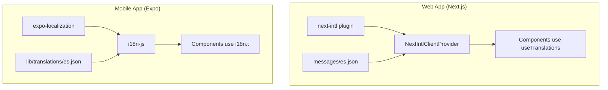

# UI Spanish Translation with i18n Infrastructure

## Architecture Overview



## Phase 1: Web App i18n Setup (next-intl)

### 1.1 Install Dependencies

```bash
bun run add:web -- next-intl
```

### 1.2 Create Configuration Files

- [`apps/web/i18n/request.ts`](apps/web/i18n/request.ts) - Request config for server components
- [`apps/web/next.config.ts`](apps/web/next.config.ts) - Add next-intl plugin wrapper
- [`apps/web/app/layout.tsx`](apps/web/app/layout.tsx) - Wrap with NextIntlClientProvider

### 1.3 Create Spanish Translation Files

- [`apps/web/messages/es.json`](apps/web/messages/es.json) - All Spanish translations organized by namespace:
  - `Common` - Shared labels (Save, Cancel, Delete, Loading, etc.)
  - `Navigation` - Sidebar items (Dashboard, Employees, Locations, etc.)
  - `Employees` - Employee management page strings
  - `Devices` - Device management strings
  - `Locations` - Location management strings
  - `Attendance` - Attendance page strings
  - `Payroll` - Payroll page strings
  - `Auth` - Login/signup forms
  - `Errors` - Error messages
  - `Dialogs` - Confirmation dialogs

### 1.4 Update Web Components

Key files to update (using `useTranslations` hook):

- [`apps/web/components/app-sidebar.tsx`](apps/web/components/app-sidebar.tsx) - Navigation labels
- [`apps/web/app/(dashboard)/employees/employees-client.tsx`](apps/web/app/\\\\(dashboard)/employees/employees-client.tsx) - Form labels, table headers, messages
- All other dashboard client components (~12 files)
- Auth pages (~5 files)
- Shared components (dialogs, forms)

---

## Phase 2: Mobile App i18n Setup (expo-localization + i18n-js)

### 2.1 Install Dependencies

```bash
bun run add:mobile -- expo-localization i18n-js
```

### 2.2 Create i18n Configuration

- [`apps/mobile/lib/i18n.ts`](apps/mobile/lib/i18n.ts) - i18n instance setup with Spanish as default

### 2.3 Create Spanish Translation Files

- [`apps/mobile/lib/translations/es.json`](apps/mobile/lib/translations/es.json) - Mobile-specific Spanish translations:
  - `Scanner` - Face scanning UI strings
  - `Settings` - Device settings strings
  - `Login` - Device login flow strings
  - `DeviceSetup` - Setup wizard strings
  - `Common` - Shared mobile labels
  - `Errors` - Error messages

### 2.4 Update Mobile Components

Key files to update (using `i18n.t()` function):

- [`apps/mobile/app/(main)/scanner.tsx`](apps/mobile/app/\\\\(main)/scanner.tsx) - Scanner UI strings
- [`apps/mobile/app/(auth)/login.tsx`](apps/mobile/app/\\\\(auth)/login.tsx) - Login flow strings
- [`apps/mobile/app/(auth)/device-setup.tsx`](apps/mobile/app/\\\\(auth)/device-setup.tsx) - Setup strings
- [`apps/mobile/app/(main)/settings.tsx`](apps/mobile/app/\\\\(main)/settings.tsx) - Settings strings

---

## Phase 3: Update AGENTS.md

Add new section under "Coding Style and Naming Conventions":

```markdown
## Language & Localization

- **All UI strings must be in Spanish** (Latin American, Mexican Spanish preferred).
- Use i18n infrastructure: `next-intl` for web, `expo-localization` + `i18n-js` for mobile.
- Never hardcode user-facing strings; always use translation keys.
- Translation files: `apps/web/messages/es.json` and `apps/mobile/lib/translations/es.json`.
```

---

## Translation Samples

### Spanish Navigation Labels

| English | Spanish (es-MX) |

|---------|-----------------|

| Dashboard | Panel de Control |

| Employees | Empleados |

| Job Positions | Puestos de Trabajo |

| Devices | Dispositivos |

| Locations | Ubicaciones |

| Attendance | Asistencia |

| Payroll | Nómina |

| Settings | Configuración |

| Sign out | Cerrar Sesión |

### Spanish Common Actions

| English | Spanish (es-MX) |

|---------|-----------------|

| Save | Guardar |

| Cancel | Cancelar |

| Delete | Eliminar |

| Edit | Editar |

| Add | Agregar |

| Search | Buscar |

| Loading... | Cargando... |

| Confirm | Confirmar |

---

## File Count Estimate

- **Web**: ~50 files to update (12 dashboard pages, 5 auth pages, ~33 components)
- **Mobile**: ~7 screens + ~10 component files
- **New files**: ~6 (i18n config + translation JSONs)

---

## Implementation Guidelines

- **Follow [AGENTS.md](AGENTS.md)** - All code must adhere to repository guidelines including:
  - Strict TypeScript typing for all functions, variables, and component props
  - JSDoc documentation for all functions with `@param`, `@returns`, and `@throws`
  - Prettier formatting (2 spaces, semicolons)
  - Conventional commit messages (`feat(web): ...`, `feat(mobile): ...`)

---

## Phase 4: Quality Checks

After all translations are implemented, run the following commands from the project root:

```bash
# Format all files
bun run format

# Run linting across all workspaces
bun run lint

# Run type checking across all workspaces
bun run check-types
```

Fix any errors before considering the task complete.

---

## Implementation Guidelines

- **Follow AGENTS.md**: All code must adhere to the repository guidelines in [AGENTS.md](AGENTS.md), including:
  - Strict TypeScript typing for all functions, variables, and component props
  - JSDoc documentation for all functions with `@param`, `@returns`, `@throws`
  - Prettier formatting (2 spaces, semicolons)
  - Conventional commit messages (`feat(web): ...`, `feat(mobile): ...`)

---

## Phase 4: Quality Checks

After all translations are complete, run the following commands to ensure code quality:

```bash
# Format all files
bun run format

# Run linting across all workspaces
bun run lint

# Run type checks across all workspaces
bun run check-types
```

Fix any lint or type errors before committing.