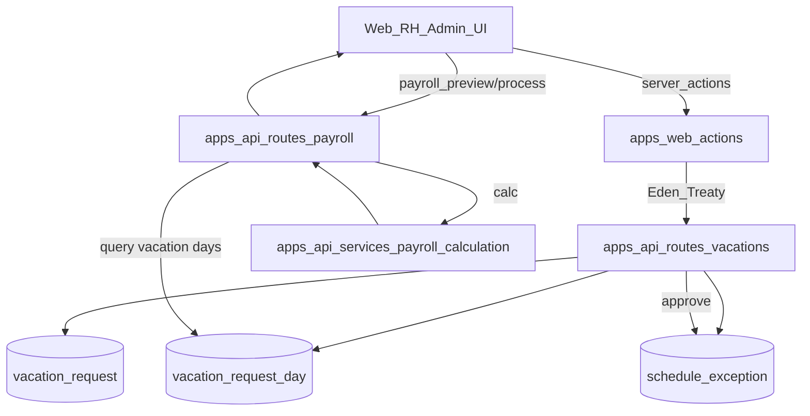

# Plan de implementación — Vacaciones (LFT México) en SEN-CheckIn

## Objetivo y alcance

- **Objetivo**: implementar un módulo de **Vacaciones** conforme a LFT México (mínimos), con flujo híbrido.
- **Híbrido (decisión confirmada)**:
- **Web (apps/web)**: **solo RH/Admin** gestiona solicitudes (crear / aprobar / rechazar / cancelar).
- **API (apps/api)**: incluye también endpoints **self-service** (para móvil/kiosco futuro), autenticando al empleado vía **`employee.userId`**.
- **Incluye Nómina en MVP (decisión confirmada)**: el cálculo/procesamiento de nómina debe sumar **vacation pay + prima vacacional**.

## Arquitectura (alto nivel)

## Modelo de datos (DB)

> Archivo principal: [`apps/api/src/db/schema.ts`](apps/api/src/db/schema.ts)

### Cambios propuestos

- **A) `employee.userId` (para self‑service)**
- Agregar columna `userId` nullable con FK a `user.id`.
- Agregar índice único recomendado: **`unique (organizationId, userId)`** para evitar asociar el mismo usuario a múltiples empleados dentro de la misma org.
- **B) `schedule_exception.vacationRequestId` (para revertir al cancelar)**
- Agregar columna `vacationRequestId` nullable con FK a `vacation_request.id`.
- Se usará para borrar automáticamente las excepciones creadas por una aprobación de vacaciones.
- **C) Tablas nuevas**
- `vacation_request`
    - Campos sugeridos: `id`, `organizationId`, `employeeId`, `requestedByUserId`, `status`, `startDateKey`, `endDateKey`, `requestedNotes`, `decisionNotes`, `approvedByUserId`, `approvedAt`, `rejectedByUserId`, `rejectedAt`, `cancelledByUserId`, `cancelledAt`, `createdAt`, `updatedAt`.
    - Índices: `(organizationId, status)`, `(employeeId)`, `(organizationId, startDateKey)`, `(organizationId, endDateKey)`.
- `vacation_request_day`
    - Campos sugeridos: `id`, `requestId`, `employeeId`, `dateKey`, `countsAsVacationDay`, `dayType`, `serviceYearNumber`, `createdAt`.
    - Índices: `(requestId, dateKey)` unique, `(employeeId, dateKey)`.
- **D) Nómina (persistencia de desglose)**
- Agregar columnas a `payroll_run_employee` para auditar:
    - `vacationDaysPaid` (int)
    - `vacationPayAmount` (numeric)
    - `vacationPremiumAmount` (numeric)

### Migración Drizzle (OBLIGATORIO si cambia `schema.ts`)

Usar los scripts del repo (requieren `SEN_DB_URL`):

- **Generar migración** (desde la raíz):
- `bun run db:gen`
- **Aplicar migración** (desde la raíz):
- `bun run db:mig`

Notas:

- Revisar el SQL generado en `apps/api/drizzle/*.sql` antes de aplicar.
- Si Drizzle detecta drift en una DB de desarrollo, considerar `bun run db:reset` (solo dev).

## API (apps/api)

### 1) Validaciones y schemas

Crear schemas Zod nuevos (siguiendo el patrón de [`apps/api/src/schemas/*.ts`](apps/api/src/schemas)):

- Nuevo archivo sugerido: [`apps/api/src/schemas/vacations.ts`](apps/api/src/schemas/vacations.ts)
- Reglas:
- Validar `startDateKey`/`endDateKey` con regex `YYYY-MM-DD` y `parseDateKey` existente.
- `endDateKey >= startDateKey`.
- Tipar estrictamente; **sin `any`**.
- JSDoc completo en funciones utilitarias.

### 2) Permisos y multitenancy

- Reusar `combinedAuthPlugin` + `resolveOrganizationId()` como en rutas existentes (ej. [`apps/api/src/routes/schedule-exceptions.ts`](apps/api/src/routes/schedule-exceptions.ts)).
- Para acciones de RH/Admin: validar rol **por membresía** (tabla `member`) como en [`apps/api/src/routes/organization.ts`](apps/api/src/routes/organization.ts).
- Para self-service:
- Solo **session auth**.
- Resolver empleado con `employee.userId === session.userId` y `employee.organizationId === activeOrganizationId`.

### 3) Nuevas rutas

Nuevo archivo sugerido: [`apps/api/src/routes/vacations.ts`](apps/api/src/routes/vacations.ts) y registrarlo en [`apps/api/src/index.ts`](apps/api/src/index.ts).**Self-service (API, para consumo futuro)**

- `GET /vacations/me/balance`
- `GET /vacations/me/requests?from&to&status`
- `POST /vacations/me/requests` (crea SUBMITTED)
- `POST /vacations/me/requests/:id/cancel`

**RH/Admin (usado por web)**

- `GET /vacations/requests?employeeId&status&from&to`
- `POST /vacations/requests` (crear para empleado; DRAFT o SUBMITTED)
- `POST /vacations/requests/:id/approve`
- `POST /vacations/requests/:id/reject`
- `POST /vacations/requests/:id/cancel`

### 4) Lógica de cómputo (días laborables)

- Contar días a descontar como **días laborables** según horario del empleado.
- Reusar lógica de “calendario efectivo” de [`apps/api/src/routes/scheduling.ts`](apps/api/src/routes/scheduling.ts):
    - `DAY_OFF` => no laborable
    - `MODIFIED`/`EXTRA_DAY` => laborable
    - template/manual => según `isWorkingDay`
- Descanso obligatorio (LFT Art. 74): por default **NO descuenta** del saldo.
- Usar `getMexicoMandatoryRestDayKeysForYear` + `payrollSetting.additionalMandatoryRestDays`.
- Guardar detalle por día en `vacation_request_day` para auditoría.

### 5) Aprobar = bloquear calendario

En `approve` (transacción):

- Validar traslape con solicitudes APPROVED existentes del empleado.
- Insertar `schedule_exception` tipo `DAY_OFF` para cada día `countsAsVacationDay=true`.
- Guardar `vacationRequestId` en `schedule_exception`.
- Si existe una excepción previa en esa fecha (por índice único), retornar 409 con lista de conflictos.

### 6) Cancelar

- Si la solicitud estaba APPROVED:
- Borrar `schedule_exception` donde `vacationRequestId = :id`.
- Marcar solicitud CANCELLED con auditoría.

## Nómina (apps/api + apps/web)

### 1) Enforce legal mínimo: prima vacacional >= 0.25

- API: actualizar [`apps/api/src/schemas/payroll.ts`](apps/api/src/schemas/payroll.ts) para `vacationPremiumRate: z.coerce.number().min(0.25).max(1)`.
- Web: actualizar validación en [`apps/web/app/(dashboard)/payroll-settings/payroll-settings-client.tsx`](apps/web/app/\\(dashboard)/payroll-settings/payroll-settings-client.tsx) para `min: 0.25`.

### 2) Cálculo

- En [`apps/api/src/routes/payroll.ts`](apps/api/src/routes/payroll.ts), además de asistencia/horario:
- Consultar `vacation_request_day` (join `vacation_request`) por empleado y rango del periodo.
- En [`apps/api/src/services/payroll-calculation.ts`](apps/api/src/services/payroll-calculation.ts):
- Añadir al breakdown:
    - `vacationDaysPaid`
    - `vacationPayAmount = dailyPay * vacationDaysPaid`
    - `vacationPremiumAmount = vacationPayAmount * vacationPremiumRate`
- Sumar a `totalPay` y `grossPay`.
- Persistir estos campos en `payroll_run_employee` al procesar.

### 3) Web Nómina

- Actualizar tipos en [`apps/web/lib/client-functions.ts`](apps/web/lib/client-functions.ts) (`PayrollCalculationEmployee`, `PayrollRunEmployee`).
- Actualizar UI/CSV en [`apps/web/app/(dashboard)/payroll/payroll-client.tsx`](apps/web/app/\\(dashboard)/payroll/payroll-client.tsx) para mostrar/exportar vacaciones y prima.

## Web (apps/web) — UI RH/Admin

### 1) Navegación + i18n

- Agregar item “Vacaciones” al sidebar en [`apps/web/components/app-sidebar.tsx`](apps/web/components/app-sidebar.tsx) (ruta sugerida: `/vacations`).
- Agregar keys en [`apps/web/messages/es.json`](apps/web/messages/es.json):
- `Sidebar.vacations`
- Nuevo namespace `Vacations.*` (títulos, estados, acciones, toasts, formularios).

### 2) Página nueva

Crear carpeta: [`apps/web/app/(dashboard)/vacations/`](apps/web/app/\\(dashboard)/vacations/)

- `page.tsx`: server component con `dynamic='force-dynamic'`, prefetch (sin await) siguiendo Release 04.
- `vacations-client.tsx`: client component con React Query.
- `loading.tsx`: skeleton.

### 3) Query keys + fetchers + prefetch

- Agregar `queryKeys.vacations` y `mutationKeys.vacations` en [`apps/web/lib/query-keys.ts`](apps/web/lib/query-keys.ts).
- Agregar fetchers RH/Admin en [`apps/web/lib/client-functions.ts`](apps/web/lib/client-functions.ts) y sus versiones server en [`apps/web/lib/server-client-functions.ts`](apps/web/lib/server-client-functions.ts).
- Agregar `prefetchVacations...` en [`apps/web/lib/server-functions.ts`](apps/web/lib/server-functions.ts).

### 4) Mutations (server actions)

Nuevo archivo: [`apps/web/actions/vacations.ts`](apps/web/actions/vacations.ts)

- `createVacationRequestAction`
- `approveVacationRequestAction`
- `rejectVacationRequestAction`
- `cancelVacationRequestAction`

Patrón: `'use server'` + `await headers()` + `createServerApiClient(cookieHeader)` (Release 04).

### 5) UI (shadcn + TanStack Form)

- Componentes shadcn ya disponibles (no se requiere instalar): `dialog`, `calendar`, `popover`, `tabs`, `table`, `badge`, `card`, `button`, `select`.
- Crear dialogs:
- “Crear solicitud” (seleccionar empleado + rango fechas + notas).
- “Detalle” con días que cuentan/no cuentan.
- Usar `useAppForm` (Release 06) en el diálogo de creación.
- Mantener textos en español vía `next-intl`.

> Si se decide agregar un selector con búsqueda (muchos empleados), usar CLI:> `npx shadcn@latest add command` (idealmente con `--yes` y ejecutado en `apps/web`).

## Vincular Employee ↔ User (habilita self-service)

- API: extender rutas y schemas de empleados para aceptar `userId` (solo RH/Admin), validando que el usuario sea miembro de la organización.
- Archivos: [`apps/api/src/routes/employees.ts`](apps/api/src/routes/employees.ts), [`apps/api/src/schemas/crud.ts`](apps/api/src/schemas/crud.ts)
- Web: agregar campo “Usuario” en crear/editar empleado (Select con `fetchOrganizationMembers`).
- Archivos: [`apps/web/app/(dashboard)/employees/employees-client.tsx`](apps/web/app/\\(dashboard)/employees/employees-client.tsx) + acciones ya existentes en [`apps/web/actions/employees.ts`](apps/web/actions/employees.ts)

## Pruebas

- Ajustar tests existentes de nómina para el nuevo query de vacaciones:
- [`apps/api/src/routes/payroll.test.ts`](apps/api/src/routes/payroll.test.ts)
- Agregar unit tests (Bun) para:
- Conteo de días laborables vs descanso/feriado.
- Cruce de rango y traslapes.
- Nómina: empleado sin asistencia pero con vacaciones aprobadas dentro del periodo => paga vacaciones + prima.

## Verificación (comandos recomendados)

- `bun run check-types:api` / `bun run lint:api`
- `bun run check-types:web` / `bun run lint:web`
- (Tras migración) correr una nómina de prueba y verificar: